# 🧠 Step 1: Load & Explore the Superstore Dataset

### 📌 Goal:
- Load the Superstore dataset from Kaggle
- Fix encoding issues (if any)
- Explore the first few rows and basic info

---

### 📁 Dataset Used:
- **Dataset Name**: Superstore Sales Dataset
- **File**: `SampleSuperstore.csv`
- **Path**: `/kaggle/input/superstore-data/SampleSuperstore.csv`


```python
import pandas as pd
df = pd.read_csv("/content/sample_data/SampleSuperstore.csv", encoding='latin1')  # latin1 we use bcoz there are some special char and bydefault it is UTF8
df.head() #df => dataframe
```


  <div id="df-61d360d9-26d4-4b36-8bc7-b4073e3c24d4" class="colab-df-container">
    <div>
<style scoped>
    .dataframe tbody tr th:only-of-type {
        vertical-align: middle;
    }

    .dataframe tbody tr th {
        vertical-align: top;
    }

    .dataframe thead th {
        text-align: right;
    }
</style>
<table border="1" class="dataframe">
  <thead>
    <tr style="text-align: right;">
      <th></th>
      <th>Row ID</th>
      <th>Order ID</th>
      <th>Order Date</th>
      <th>Ship Date</th>
      <th>Ship Mode</th>
      <th>Customer ID</th>
      <th>Customer Name</th>
      <th>Segment</th>
      <th>Country</th>
      <th>City</th>
      <th>...</th>
      <th>Postal Code</th>
      <th>Region</th>
      <th>Product ID</th>
      <th>Category</th>
      <th>Sub-Category</th>
      <th>Product Name</th>
      <th>Sales</th>
      <th>Quantity</th>
      <th>Discount</th>
      <th>Profit</th>
    </tr>
  </thead>
  <tbody>
    <tr>
      <th>0</th>
      <td>1</td>
      <td>CA-2016-152156</td>
      <td>11/8/2016</td>
      <td>11/11/2016</td>
      <td>Second Class</td>
      <td>CG-12520</td>
      <td>Claire Gute</td>
      <td>Consumer</td>
      <td>United States</td>
      <td>Henderson</td>
      <td>...</td>
      <td>42420</td>
      <td>South</td>
      <td>FUR-BO-10001798</td>
      <td>Furniture</td>
      <td>Bookcases</td>
      <td>Bush Somerset Collection Bookcase</td>
      <td>261.9600</td>
      <td>2</td>
      <td>0.00</td>
      <td>41.9136</td>
    </tr>
    <tr>
      <th>1</th>
      <td>2</td>
      <td>CA-2016-152156</td>
      <td>11/8/2016</td>
      <td>11/11/2016</td>
      <td>Second Class</td>
      <td>CG-12520</td>
      <td>Claire Gute</td>
      <td>Consumer</td>
      <td>United States</td>
      <td>Henderson</td>
      <td>...</td>
      <td>42420</td>
      <td>South</td>
      <td>FUR-CH-10000454</td>
      <td>Furniture</td>
      <td>Chairs</td>
      <td>Hon Deluxe Fabric Upholstered Stacking Chairs,...</td>
      <td>731.9400</td>
      <td>3</td>
      <td>0.00</td>
      <td>219.5820</td>
    </tr>
    <tr>
      <th>2</th>
      <td>3</td>
      <td>CA-2016-138688</td>
      <td>6/12/2016</td>
      <td>6/16/2016</td>
      <td>Second Class</td>
      <td>DV-13045</td>
      <td>Darrin Van Huff</td>
      <td>Corporate</td>
      <td>United States</td>
      <td>Los Angeles</td>
      <td>...</td>
      <td>90036</td>
      <td>West</td>
      <td>OFF-LA-10000240</td>
      <td>Office Supplies</td>
      <td>Labels</td>
      <td>Self-Adhesive Address Labels for Typewriters b...</td>
      <td>14.6200</td>
      <td>2</td>
      <td>0.00</td>
      <td>6.8714</td>
    </tr>
    <tr>
      <th>3</th>
      <td>4</td>
      <td>US-2015-108966</td>
      <td>10/11/2015</td>
      <td>10/18/2015</td>
      <td>Standard Class</td>
      <td>SO-20335</td>
      <td>Sean O'Donnell</td>
      <td>Consumer</td>
      <td>United States</td>
      <td>Fort Lauderdale</td>
      <td>...</td>
      <td>33311</td>
      <td>South</td>
      <td>FUR-TA-10000577</td>
      <td>Furniture</td>
      <td>Tables</td>
      <td>Bretford CR4500 Series Slim Rectangular Table</td>
      <td>957.5775</td>
      <td>5</td>
      <td>0.45</td>
      <td>-383.0310</td>
    </tr>
    <tr>
      <th>4</th>
      <td>5</td>
      <td>US-2015-108966</td>
      <td>10/11/2015</td>
      <td>10/18/2015</td>
      <td>Standard Class</td>
      <td>SO-20335</td>
      <td>Sean O'Donnell</td>
      <td>Consumer</td>
      <td>United States</td>
      <td>Fort Lauderdale</td>
      <td>...</td>
      <td>33311</td>
      <td>South</td>
      <td>OFF-ST-10000760</td>
      <td>Office Supplies</td>
      <td>Storage</td>
      <td>Eldon Fold 'N Roll Cart System</td>
      <td>22.3680</td>
      <td>2</td>
      <td>0.20</td>
      <td>2.5164</td>
    </tr>
  </tbody>
</table>
<p>5 rows × 21 columns</p>
</div>
    <div class="colab-df-buttons">

  <div class="colab-df-container">
    <button class="colab-df-convert" onclick="convertToInteractive('df-61d360d9-26d4-4b36-8bc7-b4073e3c24d4')"
            title="Convert this dataframe to an interactive table."
            style="display:none;">

  <svg xmlns="http://www.w3.org/2000/svg" height="24px" viewBox="0 -960 960 960">
    <path d="M120-120v-720h720v720H120Zm60-500h600v-160H180v160Zm220 220h160v-160H400v160Zm0 220h160v-160H400v160ZM180-400h160v-160H180v160Zm440 0h160v-160H620v160ZM180-180h160v-160H180v160Zm440 0h160v-160H620v160Z"/>
  </svg>
    </button>

  <style>
    .colab-df-container {
      display:flex;
      gap: 12px;
    }

    .colab-df-convert {
      background-color: #E8F0FE;
      border: none;
      border-radius: 50%;
      cursor: pointer;
      display: none;
      fill: #1967D2;
      height: 32px;
      padding: 0 0 0 0;
      width: 32px;
    }

    .colab-df-convert:hover {
      background-color: #E2EBFA;
      box-shadow: 0px 1px 2px rgba(60, 64, 67, 0.3), 0px 1px 3px 1px rgba(60, 64, 67, 0.15);
      fill: #174EA6;
    }

    .colab-df-buttons div {
      margin-bottom: 4px;
    }

    [theme=dark] .colab-df-convert {
      background-color: #3B4455;
      fill: #D2E3FC;
    }

    [theme=dark] .colab-df-convert:hover {
      background-color: #434B5C;
      box-shadow: 0px 1px 3px 1px rgba(0, 0, 0, 0.15);
      filter: drop-shadow(0px 1px 2px rgba(0, 0, 0, 0.3));
      fill: #FFFFFF;
    }
  </style>

    <script>
      const buttonEl =
        document.querySelector('#df-61d360d9-26d4-4b36-8bc7-b4073e3c24d4 button.colab-df-convert');
      buttonEl.style.display =
        google.colab.kernel.accessAllowed ? 'block' : 'none';

      async function convertToInteractive(key) {
        const element = document.querySelector('#df-61d360d9-26d4-4b36-8bc7-b4073e3c24d4');
        const dataTable =
          await google.colab.kernel.invokeFunction('convertToInteractive',
                                                    [key], {});
        if (!dataTable) return;

        const docLinkHtml = 'Like what you see? Visit the ' +
          '<a target="_blank" href=https://colab.research.google.com/notebooks/data_table.ipynb>data table notebook</a>'
          + ' to learn more about interactive tables.';
        element.innerHTML = '';
        dataTable['output_type'] = 'display_data';
        await google.colab.output.renderOutput(dataTable, element);
        const docLink = document.createElement('div');
        docLink.innerHTML = docLinkHtml;
        element.appendChild(docLink);
      }
    </script>
  </div>


    <div id="df-bf13f93c-d8e5-41ad-ad01-ec087dcff9da">
      <button class="colab-df-quickchart" onclick="quickchart('df-bf13f93c-d8e5-41ad-ad01-ec087dcff9da')"
                title="Suggest charts"
                style="display:none;">

<svg xmlns="http://www.w3.org/2000/svg" height="24px"viewBox="0 0 24 24"
     width="24px">
    <g>
        <path d="M19 3H5c-1.1 0-2 .9-2 2v14c0 1.1.9 2 2 2h14c1.1 0 2-.9 2-2V5c0-1.1-.9-2-2-2zM9 17H7v-7h2v7zm4 0h-2V7h2v10zm4 0h-2v-4h2v4z"/>
    </g>
</svg>
      </button>

<style>
  .colab-df-quickchart {
      --bg-color: #E8F0FE;
      --fill-color: #1967D2;
      --hover-bg-color: #E2EBFA;
      --hover-fill-color: #174EA6;
      --disabled-fill-color: #AAA;
      --disabled-bg-color: #DDD;
  }

  [theme=dark] .colab-df-quickchart {
      --bg-color: #3B4455;
      --fill-color: #D2E3FC;
      --hover-bg-color: #434B5C;
      --hover-fill-color: #FFFFFF;
      --disabled-bg-color: #3B4455;
      --disabled-fill-color: #666;
  }

  .colab-df-quickchart {
    background-color: var(--bg-color);
    border: none;
    border-radius: 50%;
    cursor: pointer;
    display: none;
    fill: var(--fill-color);
    height: 32px;
    padding: 0;
    width: 32px;
  }

  .colab-df-quickchart:hover {
    background-color: var(--hover-bg-color);
    box-shadow: 0 1px 2px rgba(60, 64, 67, 0.3), 0 1px 3px 1px rgba(60, 64, 67, 0.15);
    fill: var(--button-hover-fill-color);
  }

  .colab-df-quickchart-complete:disabled,
  .colab-df-quickchart-complete:disabled:hover {
    background-color: var(--disabled-bg-color);
    fill: var(--disabled-fill-color);
    box-shadow: none;
  }

  .colab-df-spinner {
    border: 2px solid var(--fill-color);
    border-color: transparent;
    border-bottom-color: var(--fill-color);
    animation:
      spin 1s steps(1) infinite;
  }

  @keyframes spin {
    0% {
      border-color: transparent;
      border-bottom-color: var(--fill-color);
      border-left-color: var(--fill-color);
    }
    20% {
      border-color: transparent;
      border-left-color: var(--fill-color);
      border-top-color: var(--fill-color);
    }
    30% {
      border-color: transparent;
      border-left-color: var(--fill-color);
      border-top-color: var(--fill-color);
      border-right-color: var(--fill-color);
    }
    40% {
      border-color: transparent;
      border-right-color: var(--fill-color);
      border-top-color: var(--fill-color);
    }
    60% {
      border-color: transparent;
      border-right-color: var(--fill-color);
    }
    80% {
      border-color: transparent;
      border-right-color: var(--fill-color);
      border-bottom-color: var(--fill-color);
    }
    90% {
      border-color: transparent;
      border-bottom-color: var(--fill-color);
    }
  }
</style>

      <script>
        async function quickchart(key) {
          const quickchartButtonEl =
            document.querySelector('#' + key + ' button');
          quickchartButtonEl.disabled = true;  // To prevent multiple clicks.
          quickchartButtonEl.classList.add('colab-df-spinner');
          try {
            const charts = await google.colab.kernel.invokeFunction(
                'suggestCharts', [key], {});
          } catch (error) {
            console.error('Error during call to suggestCharts:', error);
          }
          quickchartButtonEl.classList.remove('colab-df-spinner');
          quickchartButtonEl.classList.add('colab-df-quickchart-complete');
        }
        (() => {
          let quickchartButtonEl =
            document.querySelector('#df-bf13f93c-d8e5-41ad-ad01-ec087dcff9da button');
          quickchartButtonEl.style.display =
            google.colab.kernel.accessAllowed ? 'block' : 'none';
        })();
      </script>
    </div>

    </div>
  </div>


# 🧼 Step 2: Clean & Prepare Time Series Data

### 1. Clean Column Names
We made all column names lowercase and replaced spaces with underscores to avoid coding errors.

### 2. Convert order_date to Datetime Format
This helps Prophet model understand the time-series nature of the data.

### 3. Group Daily Sales
We summed up sales on the same dates to get one row per day.

### 4. Rename Columns for Prophet
Prophet model requires columns to be named ds for date and y for the value.

### 5. Save Cleaned Data
To reuse or import into Power BI later, we save it as a CSV.


```python
# 1. Clean Column Names
df.columns = df.columns.str.strip().str.lower().str.replace(' ','_')
df.head()
```


  <div id="df-986e0a12-4b06-4dd0-9a67-e2786e8e32ae" class="colab-df-container">
    <div>
<style scoped>
    .dataframe tbody tr th:only-of-type {
        vertical-align: middle;
    }

    .dataframe tbody tr th {
        vertical-align: top;
    }

    .dataframe thead th {
        text-align: right;
    }
</style>
<table border="1" class="dataframe">
  <thead>
    <tr style="text-align: right;">
      <th></th>
      <th>row_id</th>
      <th>order_id</th>
      <th>order_date</th>
      <th>ship_date</th>
      <th>ship_mode</th>
      <th>customer_id</th>
      <th>customer_name</th>
      <th>segment</th>
      <th>country</th>
      <th>city</th>
      <th>...</th>
      <th>postal_code</th>
      <th>region</th>
      <th>product_id</th>
      <th>category</th>
      <th>sub-category</th>
      <th>product_name</th>
      <th>sales</th>
      <th>quantity</th>
      <th>discount</th>
      <th>profit</th>
    </tr>
  </thead>
  <tbody>
    <tr>
      <th>0</th>
      <td>1</td>
      <td>CA-2016-152156</td>
      <td>11/8/2016</td>
      <td>11/11/2016</td>
      <td>Second Class</td>
      <td>CG-12520</td>
      <td>Claire Gute</td>
      <td>Consumer</td>
      <td>United States</td>
      <td>Henderson</td>
      <td>...</td>
      <td>42420</td>
      <td>South</td>
      <td>FUR-BO-10001798</td>
      <td>Furniture</td>
      <td>Bookcases</td>
      <td>Bush Somerset Collection Bookcase</td>
      <td>261.9600</td>
      <td>2</td>
      <td>0.00</td>
      <td>41.9136</td>
    </tr>
    <tr>
      <th>1</th>
      <td>2</td>
      <td>CA-2016-152156</td>
      <td>11/8/2016</td>
      <td>11/11/2016</td>
      <td>Second Class</td>
      <td>CG-12520</td>
      <td>Claire Gute</td>
      <td>Consumer</td>
      <td>United States</td>
      <td>Henderson</td>
      <td>...</td>
      <td>42420</td>
      <td>South</td>
      <td>FUR-CH-10000454</td>
      <td>Furniture</td>
      <td>Chairs</td>
      <td>Hon Deluxe Fabric Upholstered Stacking Chairs,...</td>
      <td>731.9400</td>
      <td>3</td>
      <td>0.00</td>
      <td>219.5820</td>
    </tr>
    <tr>
      <th>2</th>
      <td>3</td>
      <td>CA-2016-138688</td>
      <td>6/12/2016</td>
      <td>6/16/2016</td>
      <td>Second Class</td>
      <td>DV-13045</td>
      <td>Darrin Van Huff</td>
      <td>Corporate</td>
      <td>United States</td>
      <td>Los Angeles</td>
      <td>...</td>
      <td>90036</td>
      <td>West</td>
      <td>OFF-LA-10000240</td>
      <td>Office Supplies</td>
      <td>Labels</td>
      <td>Self-Adhesive Address Labels for Typewriters b...</td>
      <td>14.6200</td>
      <td>2</td>
      <td>0.00</td>
      <td>6.8714</td>
    </tr>
    <tr>
      <th>3</th>
      <td>4</td>
      <td>US-2015-108966</td>
      <td>10/11/2015</td>
      <td>10/18/2015</td>
      <td>Standard Class</td>
      <td>SO-20335</td>
      <td>Sean O'Donnell</td>
      <td>Consumer</td>
      <td>United States</td>
      <td>Fort Lauderdale</td>
      <td>...</td>
      <td>33311</td>
      <td>South</td>
      <td>FUR-TA-10000577</td>
      <td>Furniture</td>
      <td>Tables</td>
      <td>Bretford CR4500 Series Slim Rectangular Table</td>
      <td>957.5775</td>
      <td>5</td>
      <td>0.45</td>
      <td>-383.0310</td>
    </tr>
    <tr>
      <th>4</th>
      <td>5</td>
      <td>US-2015-108966</td>
      <td>10/11/2015</td>
      <td>10/18/2015</td>
      <td>Standard Class</td>
      <td>SO-20335</td>
      <td>Sean O'Donnell</td>
      <td>Consumer</td>
      <td>United States</td>
      <td>Fort Lauderdale</td>
      <td>...</td>
      <td>33311</td>
      <td>South</td>
      <td>OFF-ST-10000760</td>
      <td>Office Supplies</td>
      <td>Storage</td>
      <td>Eldon Fold 'N Roll Cart System</td>
      <td>22.3680</td>
      <td>2</td>
      <td>0.20</td>
      <td>2.5164</td>
    </tr>
  </tbody>
</table>
<p>5 rows × 21 columns</p>
</div>
    <div class="colab-df-buttons">

  <div class="colab-df-container">
    <button class="colab-df-convert" onclick="convertToInteractive('df-986e0a12-4b06-4dd0-9a67-e2786e8e32ae')"
            title="Convert this dataframe to an interactive table."
            style="display:none;">

  <svg xmlns="http://www.w3.org/2000/svg" height="24px" viewBox="0 -960 960 960">
    <path d="M120-120v-720h720v720H120Zm60-500h600v-160H180v160Zm220 220h160v-160H400v160Zm0 220h160v-160H400v160ZM180-400h160v-160H180v160Zm440 0h160v-160H620v160ZM180-180h160v-160H180v160Zm440 0h160v-160H620v160Z"/>
  </svg>
    </button>

  <style>
    .colab-df-container {
      display:flex;
      gap: 12px;
    }

    .colab-df-convert {
      background-color: #E8F0FE;
      border: none;
      border-radius: 50%;
      cursor: pointer;
      display: none;
      fill: #1967D2;
      height: 32px;
      padding: 0 0 0 0;
      width: 32px;
    }

    .colab-df-convert:hover {
      background-color: #E2EBFA;
      box-shadow: 0px 1px 2px rgba(60, 64, 67, 0.3), 0px 1px 3px 1px rgba(60, 64, 67, 0.15);
      fill: #174EA6;
    }

    .colab-df-buttons div {
      margin-bottom: 4px;
    }

    [theme=dark] .colab-df-convert {
      background-color: #3B4455;
      fill: #D2E3FC;
    }

    [theme=dark] .colab-df-convert:hover {
      background-color: #434B5C;
      box-shadow: 0px 1px 3px 1px rgba(0, 0, 0, 0.15);
      filter: drop-shadow(0px 1px 2px rgba(0, 0, 0, 0.3));
      fill: #FFFFFF;
    }
  </style>

    <script>
      const buttonEl =
        document.querySelector('#df-986e0a12-4b06-4dd0-9a67-e2786e8e32ae button.colab-df-convert');
      buttonEl.style.display =
        google.colab.kernel.accessAllowed ? 'block' : 'none';

      async function convertToInteractive(key) {
        const element = document.querySelector('#df-986e0a12-4b06-4dd0-9a67-e2786e8e32ae');
        const dataTable =
          await google.colab.kernel.invokeFunction('convertToInteractive',
                                                    [key], {});
        if (!dataTable) return;

        const docLinkHtml = 'Like what you see? Visit the ' +
          '<a target="_blank" href=https://colab.research.google.com/notebooks/data_table.ipynb>data table notebook</a>'
          + ' to learn more about interactive tables.';
        element.innerHTML = '';
        dataTable['output_type'] = 'display_data';
        await google.colab.output.renderOutput(dataTable, element);
        const docLink = document.createElement('div');
        docLink.innerHTML = docLinkHtml;
        element.appendChild(docLink);
      }
    </script>
  </div>


    <div id="df-6ce0e7ec-e27e-4ca3-91ca-32a83547a175">
      <button class="colab-df-quickchart" onclick="quickchart('df-6ce0e7ec-e27e-4ca3-91ca-32a83547a175')"
                title="Suggest charts"
                style="display:none;">

<svg xmlns="http://www.w3.org/2000/svg" height="24px"viewBox="0 0 24 24"
     width="24px">
    <g>
        <path d="M19 3H5c-1.1 0-2 .9-2 2v14c0 1.1.9 2 2 2h14c1.1 0 2-.9 2-2V5c0-1.1-.9-2-2-2zM9 17H7v-7h2v7zm4 0h-2V7h2v10zm4 0h-2v-4h2v4z"/>
    </g>
</svg>
      </button>

<style>
  .colab-df-quickchart {
      --bg-color: #E8F0FE;
      --fill-color: #1967D2;
      --hover-bg-color: #E2EBFA;
      --hover-fill-color: #174EA6;
      --disabled-fill-color: #AAA;
      --disabled-bg-color: #DDD;
  }

  [theme=dark] .colab-df-quickchart {
      --bg-color: #3B4455;
      --fill-color: #D2E3FC;
      --hover-bg-color: #434B5C;
      --hover-fill-color: #FFFFFF;
      --disabled-bg-color: #3B4455;
      --disabled-fill-color: #666;
  }

  .colab-df-quickchart {
    background-color: var(--bg-color);
    border: none;
    border-radius: 50%;
    cursor: pointer;
    display: none;
    fill: var(--fill-color);
    height: 32px;
    padding: 0;
    width: 32px;
  }

  .colab-df-quickchart:hover {
    background-color: var(--hover-bg-color);
    box-shadow: 0 1px 2px rgba(60, 64, 67, 0.3), 0 1px 3px 1px rgba(60, 64, 67, 0.15);
    fill: var(--button-hover-fill-color);
  }

  .colab-df-quickchart-complete:disabled,
  .colab-df-quickchart-complete:disabled:hover {
    background-color: var(--disabled-bg-color);
    fill: var(--disabled-fill-color);
    box-shadow: none;
  }

  .colab-df-spinner {
    border: 2px solid var(--fill-color);
    border-color: transparent;
    border-bottom-color: var(--fill-color);
    animation:
      spin 1s steps(1) infinite;
  }

  @keyframes spin {
    0% {
      border-color: transparent;
      border-bottom-color: var(--fill-color);
      border-left-color: var(--fill-color);
    }
    20% {
      border-color: transparent;
      border-left-color: var(--fill-color);
      border-top-color: var(--fill-color);
    }
    30% {
      border-color: transparent;
      border-left-color: var(--fill-color);
      border-top-color: var(--fill-color);
      border-right-color: var(--fill-color);
    }
    40% {
      border-color: transparent;
      border-right-color: var(--fill-color);
      border-top-color: var(--fill-color);
    }
    60% {
      border-color: transparent;
      border-right-color: var(--fill-color);
    }
    80% {
      border-color: transparent;
      border-right-color: var(--fill-color);
      border-bottom-color: var(--fill-color);
    }
    90% {
      border-color: transparent;
      border-bottom-color: var(--fill-color);
    }
  }
</style>

      <script>
        async function quickchart(key) {
          const quickchartButtonEl =
            document.querySelector('#' + key + ' button');
          quickchartButtonEl.disabled = true;  // To prevent multiple clicks.
          quickchartButtonEl.classList.add('colab-df-spinner');
          try {
            const charts = await google.colab.kernel.invokeFunction(
                'suggestCharts', [key], {});
          } catch (error) {
            console.error('Error during call to suggestCharts:', error);
          }
          quickchartButtonEl.classList.remove('colab-df-spinner');
          quickchartButtonEl.classList.add('colab-df-quickchart-complete');
        }
        (() => {
          let quickchartButtonEl =
            document.querySelector('#df-6ce0e7ec-e27e-4ca3-91ca-32a83547a175 button');
          quickchartButtonEl.style.display =
            google.colab.kernel.accessAllowed ? 'block' : 'none';
        })();
      </script>
    </div>

    </div>
  </div>


```python
# 2. Convert order_date to Datetime Format
df['order_date'] = pd.to_datetime(df['order_date'])
df.dtypes
```


<div>
<style scoped>
    .dataframe tbody tr th:only-of-type {
        vertical-align: middle;
    }

    .dataframe tbody tr th {
        vertical-align: top;
    }

    .dataframe thead th {
        text-align: right;
    }
</style>
<table border="1" class="dataframe">
  <thead>
    <tr style="text-align: right;">
      <th></th>
      <th>0</th>
    </tr>
  </thead>
  <tbody>
    <tr>
      <th>row_id</th>
      <td>int64</td>
    </tr>
    <tr>
      <th>order_id</th>
      <td>object</td>
    </tr>
    <tr>
      <th>order_date</th>
      <td>datetime64[ns]</td>
    </tr>
    <tr>
      <th>ship_date</th>
      <td>object</td>
    </tr>
    <tr>
      <th>ship_mode</th>
      <td>object</td>
    </tr>
    <tr>
      <th>customer_id</th>
      <td>object</td>
    </tr>
    <tr>
      <th>customer_name</th>
      <td>object</td>
    </tr>
    <tr>
      <th>segment</th>
      <td>object</td>
    </tr>
    <tr>
      <th>country</th>
      <td>object</td>
    </tr>
    <tr>
      <th>city</th>
      <td>object</td>
    </tr>
    <tr>
      <th>state</th>
      <td>object</td>
    </tr>
    <tr>
      <th>postal_code</th>
      <td>int64</td>
    </tr>
    <tr>
      <th>region</th>
      <td>object</td>
    </tr>
    <tr>
      <th>product_id</th>
      <td>object</td>
    </tr>
    <tr>
      <th>category</th>
      <td>object</td>
    </tr>
    <tr>
      <th>sub-category</th>
      <td>object</td>
    </tr>
    <tr>
      <th>product_name</th>
      <td>object</td>
    </tr>
    <tr>
      <th>sales</th>
      <td>float64</td>
    </tr>
    <tr>
      <th>quantity</th>
      <td>int64</td>
    </tr>
    <tr>
      <th>discount</th>
      <td>float64</td>
    </tr>
    <tr>
      <th>profit</th>
      <td>float64</td>
    </tr>
  </tbody>
</table>
</div><br><label><b>dtype:</b> object</label>


```python
# 3. Group Daily Sales
daily_sales = df.groupby('order_date')['sales'].sum().reset_index()
daily_sales.head()
```


  <div id="df-c9f48871-5334-4e3a-b39b-ce0b75d558eb" class="colab-df-container">
    <div>
<style scoped>
    .dataframe tbody tr th:only-of-type {
        vertical-align: middle;
    }

    .dataframe tbody tr th {
        vertical-align: top;
    }

    .dataframe thead th {
        text-align: right;
    }
</style>
<table border="1" class="dataframe">
  <thead>
    <tr style="text-align: right;">
      <th></th>
      <th>order_date</th>
      <th>sales</th>
    </tr>
  </thead>
  <tbody>
    <tr>
      <th>0</th>
      <td>2014-01-03</td>
      <td>16.448</td>
    </tr>
    <tr>
      <th>1</th>
      <td>2014-01-04</td>
      <td>288.060</td>
    </tr>
    <tr>
      <th>2</th>
      <td>2014-01-05</td>
      <td>19.536</td>
    </tr>
    <tr>
      <th>3</th>
      <td>2014-01-06</td>
      <td>4407.100</td>
    </tr>
    <tr>
      <th>4</th>
      <td>2014-01-07</td>
      <td>87.158</td>
    </tr>
  </tbody>
</table>
</div>
    <div class="colab-df-buttons">

  <div class="colab-df-container">
    <button class="colab-df-convert" onclick="convertToInteractive('df-c9f48871-5334-4e3a-b39b-ce0b75d558eb')"
            title="Convert this dataframe to an interactive table."
            style="display:none;">

  <svg xmlns="http://www.w3.org/2000/svg" height="24px" viewBox="0 -960 960 960">
    <path d="M120-120v-720h720v720H120Zm60-500h600v-160H180v160Zm220 220h160v-160H400v160Zm0 220h160v-160H400v160ZM180-400h160v-160H180v160Zm440 0h160v-160H620v160ZM180-180h160v-160H180v160Zm440 0h160v-160H620v160Z"/>
  </svg>
    </button>

  <style>
    .colab-df-container {
      display:flex;
      gap: 12px;
    }

    .colab-df-convert {
      background-color: #E8F0FE;
      border: none;
      border-radius: 50%;
      cursor: pointer;
      display: none;
      fill: #1967D2;
      height: 32px;
      padding: 0 0 0 0;
      width: 32px;
    }

    .colab-df-convert:hover {
      background-color: #E2EBFA;
      box-shadow: 0px 1px 2px rgba(60, 64, 67, 0.3), 0px 1px 3px 1px rgba(60, 64, 67, 0.15);
      fill: #174EA6;
    }

    .colab-df-buttons div {
      margin-bottom: 4px;
    }

    [theme=dark] .colab-df-convert {
      background-color: #3B4455;
      fill: #D2E3FC;
    }

    [theme=dark] .colab-df-convert:hover {
      background-color: #434B5C;
      box-shadow: 0px 1px 3px 1px rgba(0, 0, 0, 0.15);
      filter: drop-shadow(0px 1px 2px rgba(0, 0, 0, 0.3));
      fill: #FFFFFF;
    }
  </style>

    <script>
      const buttonEl =
        document.querySelector('#df-c9f48871-5334-4e3a-b39b-ce0b75d558eb button.colab-df-convert');
      buttonEl.style.display =
        google.colab.kernel.accessAllowed ? 'block' : 'none';

      async function convertToInteractive(key) {
        const element = document.querySelector('#df-c9f48871-5334-4e3a-b39b-ce0b75d558eb');
        const dataTable =
          await google.colab.kernel.invokeFunction('convertToInteractive',
                                                    [key], {});
        if (!dataTable) return;

        const docLinkHtml = 'Like what you see? Visit the ' +
          '<a target="_blank" href=https://colab.research.google.com/notebooks/data_table.ipynb>data table notebook</a>'
          + ' to learn more about interactive tables.';
        element.innerHTML = '';
        dataTable['output_type'] = 'display_data';
        await google.colab.output.renderOutput(dataTable, element);
        const docLink = document.createElement('div');
        docLink.innerHTML = docLinkHtml;
        element.appendChild(docLink);
      }
    </script>
  </div>


    <div id="df-642c4c4a-29b0-4147-91a0-686c85f58ba2">
      <button class="colab-df-quickchart" onclick="quickchart('df-642c4c4a-29b0-4147-91a0-686c85f58ba2')"
                title="Suggest charts"
                style="display:none;">

<svg xmlns="http://www.w3.org/2000/svg" height="24px"viewBox="0 0 24 24"
     width="24px">
    <g>
        <path d="M19 3H5c-1.1 0-2 .9-2 2v14c0 1.1.9 2 2 2h14c1.1 0 2-.9 2-2V5c0-1.1-.9-2-2-2zM9 17H7v-7h2v7zm4 0h-2V7h2v10zm4 0h-2v-4h2v4z"/>
    </g>
</svg>
      </button>

<style>
  .colab-df-quickchart {
      --bg-color: #E8F0FE;
      --fill-color: #1967D2;
      --hover-bg-color: #E2EBFA;
      --hover-fill-color: #174EA6;
      --disabled-fill-color: #AAA;
      --disabled-bg-color: #DDD;
  }

  [theme=dark] .colab-df-quickchart {
      --bg-color: #3B4455;
      --fill-color: #D2E3FC;
      --hover-bg-color: #434B5C;
      --hover-fill-color: #FFFFFF;
      --disabled-bg-color: #3B4455;
      --disabled-fill-color: #666;
  }

  .colab-df-quickchart {
    background-color: var(--bg-color);
    border: none;
    border-radius: 50%;
    cursor: pointer;
    display: none;
    fill: var(--fill-color);
    height: 32px;
    padding: 0;
    width: 32px;
  }

  .colab-df-quickchart:hover {
    background-color: var(--hover-bg-color);
    box-shadow: 0 1px 2px rgba(60, 64, 67, 0.3), 0 1px 3px 1px rgba(60, 64, 67, 0.15);
    fill: var(--button-hover-fill-color);
  }

  .colab-df-quickchart-complete:disabled,
  .colab-df-quickchart-complete:disabled:hover {
    background-color: var(--disabled-bg-color);
    fill: var(--disabled-fill-color);
    box-shadow: none;
  }

  .colab-df-spinner {
    border: 2px solid var(--fill-color);
    border-color: transparent;
    border-bottom-color: var(--fill-color);
    animation:
      spin 1s steps(1) infinite;
  }

  @keyframes spin {
    0% {
      border-color: transparent;
      border-bottom-color: var(--fill-color);
      border-left-color: var(--fill-color);
    }
    20% {
      border-color: transparent;
      border-left-color: var(--fill-color);
      border-top-color: var(--fill-color);
    }
    30% {
      border-color: transparent;
      border-left-color: var(--fill-color);
      border-top-color: var(--fill-color);
      border-right-color: var(--fill-color);
    }
    40% {
      border-color: transparent;
      border-right-color: var(--fill-color);
      border-top-color: var(--fill-color);
    }
    60% {
      border-color: transparent;
      border-right-color: var(--fill-color);
    }
    80% {
      border-color: transparent;
      border-right-color: var(--fill-color);
      border-bottom-color: var(--fill-color);
    }
    90% {
      border-color: transparent;
      border-bottom-color: var(--fill-color);
    }
  }
</style>

      <script>
        async function quickchart(key) {
          const quickchartButtonEl =
            document.querySelector('#' + key + ' button');
          quickchartButtonEl.disabled = true;  // To prevent multiple clicks.
          quickchartButtonEl.classList.add('colab-df-spinner');
          try {
            const charts = await google.colab.kernel.invokeFunction(
                'suggestCharts', [key], {});
          } catch (error) {
            console.error('Error during call to suggestCharts:', error);
          }
          quickchartButtonEl.classList.remove('colab-df-spinner');
          quickchartButtonEl.classList.add('colab-df-quickchart-complete');
        }
        (() => {
          let quickchartButtonEl =
            document.querySelector('#df-642c4c4a-29b0-4147-91a0-686c85f58ba2 button');
          quickchartButtonEl.style.display =
            google.colab.kernel.accessAllowed ? 'block' : 'none';
        })();
      </script>
    </div>

    </div>
  </div>


```python
# 4. Rename Columns for Prophet
daily_sales.columns = ['ds', 'y']
daily_sales.head()
```


  <div id="df-c07e5dbb-be80-46cd-88b7-b1e51427adc2" class="colab-df-container">
    <div>
<style scoped>
    .dataframe tbody tr th:only-of-type {
        vertical-align: middle;
    }

    .dataframe tbody tr th {
        vertical-align: top;
    }

    .dataframe thead th {
        text-align: right;
    }
</style>
<table border="1" class="dataframe">
  <thead>
    <tr style="text-align: right;">
      <th></th>
      <th>ds</th>
      <th>y</th>
    </tr>
  </thead>
  <tbody>
    <tr>
      <th>0</th>
      <td>2014-01-03</td>
      <td>16.448</td>
    </tr>
    <tr>
      <th>1</th>
      <td>2014-01-04</td>
      <td>288.060</td>
    </tr>
    <tr>
      <th>2</th>
      <td>2014-01-05</td>
      <td>19.536</td>
    </tr>
    <tr>
      <th>3</th>
      <td>2014-01-06</td>
      <td>4407.100</td>
    </tr>
    <tr>
      <th>4</th>
      <td>2014-01-07</td>
      <td>87.158</td>
    </tr>
  </tbody>
</table>
</div>
    <div class="colab-df-buttons">

  <div class="colab-df-container">
    <button class="colab-df-convert" onclick="convertToInteractive('df-c07e5dbb-be80-46cd-88b7-b1e51427adc2')"
            title="Convert this dataframe to an interactive table."
            style="display:none;">

  <svg xmlns="http://www.w3.org/2000/svg" height="24px" viewBox="0 -960 960 960">
    <path d="M120-120v-720h720v720H120Zm60-500h600v-160H180v160Zm220 220h160v-160H400v160Zm0 220h160v-160H400v160ZM180-400h160v-160H180v160Zm440 0h160v-160H620v160ZM180-180h160v-160H180v160Zm440 0h160v-160H620v160Z"/>
  </svg>
    </button>

  <style>
    .colab-df-container {
      display:flex;
      gap: 12px;
    }

    .colab-df-convert {
      background-color: #E8F0FE;
      border: none;
      border-radius: 50%;
      cursor: pointer;
      display: none;
      fill: #1967D2;
      height: 32px;
      padding: 0 0 0 0;
      width: 32px;
    }

    .colab-df-convert:hover {
      background-color: #E2EBFA;
      box-shadow: 0px 1px 2px rgba(60, 64, 67, 0.3), 0px 1px 3px 1px rgba(60, 64, 67, 0.15);
      fill: #174EA6;
    }

    .colab-df-buttons div {
      margin-bottom: 4px;
    }

    [theme=dark] .colab-df-convert {
      background-color: #3B4455;
      fill: #D2E3FC;
    }

    [theme=dark] .colab-df-convert:hover {
      background-color: #434B5C;
      box-shadow: 0px 1px 3px 1px rgba(0, 0, 0, 0.15);
      filter: drop-shadow(0px 1px 2px rgba(0, 0, 0, 0.3));
      fill: #FFFFFF;
    }
  </style>

    <script>
      const buttonEl =
        document.querySelector('#df-c07e5dbb-be80-46cd-88b7-b1e51427adc2 button.colab-df-convert');
      buttonEl.style.display =
        google.colab.kernel.accessAllowed ? 'block' : 'none';

      async function convertToInteractive(key) {
        const element = document.querySelector('#df-c07e5dbb-be80-46cd-88b7-b1e51427adc2');
        const dataTable =
          await google.colab.kernel.invokeFunction('convertToInteractive',
                                                    [key], {});
        if (!dataTable) return;

        const docLinkHtml = 'Like what you see? Visit the ' +
          '<a target="_blank" href=https://colab.research.google.com/notebooks/data_table.ipynb>data table notebook</a>'
          + ' to learn more about interactive tables.';
        element.innerHTML = '';
        dataTable['output_type'] = 'display_data';
        await google.colab.output.renderOutput(dataTable, element);
        const docLink = document.createElement('div');
        docLink.innerHTML = docLinkHtml;
        element.appendChild(docLink);
      }
    </script>
  </div>


    <div id="df-f9b0b1a1-ac20-4980-a095-e9684da09f05">
      <button class="colab-df-quickchart" onclick="quickchart('df-f9b0b1a1-ac20-4980-a095-e9684da09f05')"
                title="Suggest charts"
                style="display:none;">

<svg xmlns="http://www.w3.org/2000/svg" height="24px"viewBox="0 0 24 24"
     width="24px">
    <g>
        <path d="M19 3H5c-1.1 0-2 .9-2 2v14c0 1.1.9 2 2 2h14c1.1 0 2-.9 2-2V5c0-1.1-.9-2-2-2zM9 17H7v-7h2v7zm4 0h-2V7h2v10zm4 0h-2v-4h2v4z"/>
    </g>
</svg>
      </button>

<style>
  .colab-df-quickchart {
      --bg-color: #E8F0FE;
      --fill-color: #1967D2;
      --hover-bg-color: #E2EBFA;
      --hover-fill-color: #174EA6;
      --disabled-fill-color: #AAA;
      --disabled-bg-color: #DDD;
  }

  [theme=dark] .colab-df-quickchart {
      --bg-color: #3B4455;
      --fill-color: #D2E3FC;
      --hover-bg-color: #434B5C;
      --hover-fill-color: #FFFFFF;
      --disabled-bg-color: #3B4455;
      --disabled-fill-color: #666;
  }

  .colab-df-quickchart {
    background-color: var(--bg-color);
    border: none;
    border-radius: 50%;
    cursor: pointer;
    display: none;
    fill: var(--fill-color);
    height: 32px;
    padding: 0;
    width: 32px;
  }

  .colab-df-quickchart:hover {
    background-color: var(--hover-bg-color);
    box-shadow: 0 1px 2px rgba(60, 64, 67, 0.3), 0 1px 3px 1px rgba(60, 64, 67, 0.15);
    fill: var(--button-hover-fill-color);
  }

  .colab-df-quickchart-complete:disabled,
  .colab-df-quickchart-complete:disabled:hover {
    background-color: var(--disabled-bg-color);
    fill: var(--disabled-fill-color);
    box-shadow: none;
  }

  .colab-df-spinner {
    border: 2px solid var(--fill-color);
    border-color: transparent;
    border-bottom-color: var(--fill-color);
    animation:
      spin 1s steps(1) infinite;
  }

  @keyframes spin {
    0% {
      border-color: transparent;
      border-bottom-color: var(--fill-color);
      border-left-color: var(--fill-color);
    }
    20% {
      border-color: transparent;
      border-left-color: var(--fill-color);
      border-top-color: var(--fill-color);
    }
    30% {
      border-color: transparent;
      border-left-color: var(--fill-color);
      border-top-color: var(--fill-color);
      border-right-color: var(--fill-color);
    }
    40% {
      border-color: transparent;
      border-right-color: var(--fill-color);
      border-top-color: var(--fill-color);
    }
    60% {
      border-color: transparent;
      border-right-color: var(--fill-color);
    }
    80% {
      border-color: transparent;
      border-right-color: var(--fill-color);
      border-bottom-color: var(--fill-color);
    }
    90% {
      border-color: transparent;
      border-bottom-color: var(--fill-color);
    }
  }
</style>

      <script>
        async function quickchart(key) {
          const quickchartButtonEl =
            document.querySelector('#' + key + ' button');
          quickchartButtonEl.disabled = true;  // To prevent multiple clicks.
          quickchartButtonEl.classList.add('colab-df-spinner');
          try {
            const charts = await google.colab.kernel.invokeFunction(
                'suggestCharts', [key], {});
          } catch (error) {
            console.error('Error during call to suggestCharts:', error);
          }
          quickchartButtonEl.classList.remove('colab-df-spinner');
          quickchartButtonEl.classList.add('colab-df-quickchart-complete');
        }
        (() => {
          let quickchartButtonEl =
            document.querySelector('#df-f9b0b1a1-ac20-4980-a095-e9684da09f05 button');
          quickchartButtonEl.style.display =
            google.colab.kernel.accessAllowed ? 'block' : 'none';
        })();
      </script>
    </div>

    </div>
  </div>


```python
# 5. Save Cleaned Data
daily_sales.to_csv("cleaned_sales.csv", index=False)
```

# 🔮 Step 3: Forecast Sales using Prophet (ML Model)

### 📦 What is Prophet?
Prophet is a machine learning model developed by Meta (Facebook) to forecast time-series data like sales, weather, etc.

---

### 🚀 What We Did

1. **Installed Prophet** using pip in Kaggle
2. **Loaded cleaned sales data** with columns `ds` (date) and `y` (sales)
3. **Trained Prophet model** on past data
4. **Forecasted next 30 days** using `make_future_dataframe`
5. **Plotted graph** to see future sales trend

---

### 📊 Output

- Forecast table with:
  - `ds`: future dates
  - `yhat`: predicted sales
  - `yhat_lower` and `yhat_upper`: uncertainty range
- Line graph showing past + future sales trend
- Components graph showing weekly/seasonal trend


```python
!pip install prophet
```

    Requirement already satisfied: prophet in /usr/local/lib/python3.11/dist-packages (1.1.7)
    Requirement already satisfied: cmdstanpy>=1.0.4 in /usr/local/lib/python3.11/dist-packages (from prophet) (1.2.5)
    Requirement already satisfied: numpy>=1.15.4 in /usr/local/lib/python3.11/dist-packages (from prophet) (2.0.2)
    Requirement already satisfied: matplotlib>=2.0.0 in /usr/local/lib/python3.11/dist-packages (from prophet) (3.10.0)
    Requirement already satisfied: pandas>=1.0.4 in /usr/local/lib/python3.11/dist-packages (from prophet) (2.2.2)
    Requirement already satisfied: holidays<1,>=0.25 in /usr/local/lib/python3.11/dist-packages (from prophet) (0.77)
    Requirement already satisfied: tqdm>=4.36.1 in /usr/local/lib/python3.11/dist-packages (from prophet) (4.67.1)
    Requirement already satisfied: importlib_resources in /usr/local/lib/python3.11/dist-packages (from prophet) (6.5.2)
    Requirement already satisfied: stanio<2.0.0,>=0.4.0 in /usr/local/lib/python3.11/dist-packages (from cmdstanpy>=1.0.4->prophet) (0.5.1)
    Requirement already satisfied: python-dateutil in /usr/local/lib/python3.11/dist-packages (from holidays<1,>=0.25->prophet) (2.9.0.post0)
    Requirement already satisfied: contourpy>=1.0.1 in /usr/local/lib/python3.11/dist-packages (from matplotlib>=2.0.0->prophet) (1.3.2)
    Requirement already satisfied: cycler>=0.10 in /usr/local/lib/python3.11/dist-packages (from matplotlib>=2.0.0->prophet) (0.12.1)
    Requirement already satisfied: fonttools>=4.22.0 in /usr/local/lib/python3.11/dist-packages (from matplotlib>=2.0.0->prophet) (4.59.0)
    Requirement already satisfied: kiwisolver>=1.3.1 in /usr/local/lib/python3.11/dist-packages (from matplotlib>=2.0.0->prophet) (1.4.8)
    Requirement already satisfied: packaging>=20.0 in /usr/local/lib/python3.11/dist-packages (from matplotlib>=2.0.0->prophet) (25.0)
    Requirement already satisfied: pillow>=8 in /usr/local/lib/python3.11/dist-packages (from matplotlib>=2.0.0->prophet) (11.3.0)
    Requirement already satisfied: pyparsing>=2.3.1 in /usr/local/lib/python3.11/dist-packages (from matplotlib>=2.0.0->prophet) (3.2.3)
    Requirement already satisfied: pytz>=2020.1 in /usr/local/lib/python3.11/dist-packages (from pandas>=1.0.4->prophet) (2025.2)
    Requirement already satisfied: tzdata>=2022.7 in /usr/local/lib/python3.11/dist-packages (from pandas>=1.0.4->prophet) (2025.2)
    Requirement already satisfied: six>=1.5 in /usr/local/lib/python3.11/dist-packages (from python-dateutil->holidays<1,>=0.25->prophet) (1.17.0)
    


```python
# 2. Import Prophet & Load Clean Data

from prophet import Prophet
import pandas as pd

# Load the cleaned data if needed
df = pd.read_csv("cleaned_sales.csv")  # or use daily_sales if still in memory
df.head()
```


  <div id="df-25173dd7-6bef-4db1-a079-d8a26e071251" class="colab-df-container">
    <div>
<style scoped>
    .dataframe tbody tr th:only-of-type {
        vertical-align: middle;
    }

    .dataframe tbody tr th {
        vertical-align: top;
    }

    .dataframe thead th {
        text-align: right;
    }
</style>
<table border="1" class="dataframe">
  <thead>
    <tr style="text-align: right;">
      <th></th>
      <th>ds</th>
      <th>y</th>
    </tr>
  </thead>
  <tbody>
    <tr>
      <th>0</th>
      <td>2014-01-03</td>
      <td>16.448</td>
    </tr>
    <tr>
      <th>1</th>
      <td>2014-01-04</td>
      <td>288.060</td>
    </tr>
    <tr>
      <th>2</th>
      <td>2014-01-05</td>
      <td>19.536</td>
    </tr>
    <tr>
      <th>3</th>
      <td>2014-01-06</td>
      <td>4407.100</td>
    </tr>
    <tr>
      <th>4</th>
      <td>2014-01-07</td>
      <td>87.158</td>
    </tr>
  </tbody>
</table>
</div>
    <div class="colab-df-buttons">

  <div class="colab-df-container">
    <button class="colab-df-convert" onclick="convertToInteractive('df-25173dd7-6bef-4db1-a079-d8a26e071251')"
            title="Convert this dataframe to an interactive table."
            style="display:none;">

  <svg xmlns="http://www.w3.org/2000/svg" height="24px" viewBox="0 -960 960 960">
    <path d="M120-120v-720h720v720H120Zm60-500h600v-160H180v160Zm220 220h160v-160H400v160Zm0 220h160v-160H400v160ZM180-400h160v-160H180v160Zm440 0h160v-160H620v160ZM180-180h160v-160H180v160Zm440 0h160v-160H620v160Z"/>
  </svg>
    </button>

  <style>
    .colab-df-container {
      display:flex;
      gap: 12px;
    }

    .colab-df-convert {
      background-color: #E8F0FE;
      border: none;
      border-radius: 50%;
      cursor: pointer;
      display: none;
      fill: #1967D2;
      height: 32px;
      padding: 0 0 0 0;
      width: 32px;
    }

    .colab-df-convert:hover {
      background-color: #E2EBFA;
      box-shadow: 0px 1px 2px rgba(60, 64, 67, 0.3), 0px 1px 3px 1px rgba(60, 64, 67, 0.15);
      fill: #174EA6;
    }

    .colab-df-buttons div {
      margin-bottom: 4px;
    }

    [theme=dark] .colab-df-convert {
      background-color: #3B4455;
      fill: #D2E3FC;
    }

    [theme=dark] .colab-df-convert:hover {
      background-color: #434B5C;
      box-shadow: 0px 1px 3px 1px rgba(0, 0, 0, 0.15);
      filter: drop-shadow(0px 1px 2px rgba(0, 0, 0, 0.3));
      fill: #FFFFFF;
    }
  </style>

    <script>
      const buttonEl =
        document.querySelector('#df-25173dd7-6bef-4db1-a079-d8a26e071251 button.colab-df-convert');
      buttonEl.style.display =
        google.colab.kernel.accessAllowed ? 'block' : 'none';

      async function convertToInteractive(key) {
        const element = document.querySelector('#df-25173dd7-6bef-4db1-a079-d8a26e071251');
        const dataTable =
          await google.colab.kernel.invokeFunction('convertToInteractive',
                                                    [key], {});
        if (!dataTable) return;

        const docLinkHtml = 'Like what you see? Visit the ' +
          '<a target="_blank" href=https://colab.research.google.com/notebooks/data_table.ipynb>data table notebook</a>'
          + ' to learn more about interactive tables.';
        element.innerHTML = '';
        dataTable['output_type'] = 'display_data';
        await google.colab.output.renderOutput(dataTable, element);
        const docLink = document.createElement('div');
        docLink.innerHTML = docLinkHtml;
        element.appendChild(docLink);
      }
    </script>
  </div>


    <div id="df-f29eaaf9-348b-4106-b901-580273b1783d">
      <button class="colab-df-quickchart" onclick="quickchart('df-f29eaaf9-348b-4106-b901-580273b1783d')"
                title="Suggest charts"
                style="display:none;">

<svg xmlns="http://www.w3.org/2000/svg" height="24px"viewBox="0 0 24 24"
     width="24px">
    <g>
        <path d="M19 3H5c-1.1 0-2 .9-2 2v14c0 1.1.9 2 2 2h14c1.1 0 2-.9 2-2V5c0-1.1-.9-2-2-2zM9 17H7v-7h2v7zm4 0h-2V7h2v10zm4 0h-2v-4h2v4z"/>
    </g>
</svg>
      </button>

<style>
  .colab-df-quickchart {
      --bg-color: #E8F0FE;
      --fill-color: #1967D2;
      --hover-bg-color: #E2EBFA;
      --hover-fill-color: #174EA6;
      --disabled-fill-color: #AAA;
      --disabled-bg-color: #DDD;
  }

  [theme=dark] .colab-df-quickchart {
      --bg-color: #3B4455;
      --fill-color: #D2E3FC;
      --hover-bg-color: #434B5C;
      --hover-fill-color: #FFFFFF;
      --disabled-bg-color: #3B4455;
      --disabled-fill-color: #666;
  }

  .colab-df-quickchart {
    background-color: var(--bg-color);
    border: none;
    border-radius: 50%;
    cursor: pointer;
    display: none;
    fill: var(--fill-color);
    height: 32px;
    padding: 0;
    width: 32px;
  }

  .colab-df-quickchart:hover {
    background-color: var(--hover-bg-color);
    box-shadow: 0 1px 2px rgba(60, 64, 67, 0.3), 0 1px 3px 1px rgba(60, 64, 67, 0.15);
    fill: var(--button-hover-fill-color);
  }

  .colab-df-quickchart-complete:disabled,
  .colab-df-quickchart-complete:disabled:hover {
    background-color: var(--disabled-bg-color);
    fill: var(--disabled-fill-color);
    box-shadow: none;
  }

  .colab-df-spinner {
    border: 2px solid var(--fill-color);
    border-color: transparent;
    border-bottom-color: var(--fill-color);
    animation:
      spin 1s steps(1) infinite;
  }

  @keyframes spin {
    0% {
      border-color: transparent;
      border-bottom-color: var(--fill-color);
      border-left-color: var(--fill-color);
    }
    20% {
      border-color: transparent;
      border-left-color: var(--fill-color);
      border-top-color: var(--fill-color);
    }
    30% {
      border-color: transparent;
      border-left-color: var(--fill-color);
      border-top-color: var(--fill-color);
      border-right-color: var(--fill-color);
    }
    40% {
      border-color: transparent;
      border-right-color: var(--fill-color);
      border-top-color: var(--fill-color);
    }
    60% {
      border-color: transparent;
      border-right-color: var(--fill-color);
    }
    80% {
      border-color: transparent;
      border-right-color: var(--fill-color);
      border-bottom-color: var(--fill-color);
    }
    90% {
      border-color: transparent;
      border-bottom-color: var(--fill-color);
    }
  }
</style>

      <script>
        async function quickchart(key) {
          const quickchartButtonEl =
            document.querySelector('#' + key + ' button');
          quickchartButtonEl.disabled = true;  // To prevent multiple clicks.
          quickchartButtonEl.classList.add('colab-df-spinner');
          try {
            const charts = await google.colab.kernel.invokeFunction(
                'suggestCharts', [key], {});
          } catch (error) {
            console.error('Error during call to suggestCharts:', error);
          }
          quickchartButtonEl.classList.remove('colab-df-spinner');
          quickchartButtonEl.classList.add('colab-df-quickchart-complete');
        }
        (() => {
          let quickchartButtonEl =
            document.querySelector('#df-f29eaaf9-348b-4106-b901-580273b1783d button');
          quickchartButtonEl.style.display =
            google.colab.kernel.accessAllowed ? 'block' : 'none';
        })();
      </script>
    </div>

    </div>
  </div>


```python
# 3. Initialize & Train Prophet Model

model = Prophet()
model.fit(df)
```

    INFO:prophet:Disabling daily seasonality. Run prophet with daily_seasonality=True to override this.
    DEBUG:cmdstanpy:input tempfile: /tmp/tmpe6pfx1ko/br40b7qz.json
    DEBUG:cmdstanpy:input tempfile: /tmp/tmpe6pfx1ko/sn87h_z6.json
    DEBUG:cmdstanpy:idx 0
    DEBUG:cmdstanpy:running CmdStan, num_threads: None
    DEBUG:cmdstanpy:CmdStan args: ['/usr/local/lib/python3.11/dist-packages/prophet/stan_model/prophet_model.bin', 'random', 'seed=38113', 'data', 'file=/tmp/tmpe6pfx1ko/br40b7qz.json', 'init=/tmp/tmpe6pfx1ko/sn87h_z6.json', 'output', 'file=/tmp/tmpe6pfx1ko/prophet_modelrqdwl44_/prophet_model-20250727145224.csv', 'method=optimize', 'algorithm=lbfgs', 'iter=10000']
    14:52:24 - cmdstanpy - INFO - Chain [1] start processing
    INFO:cmdstanpy:Chain [1] start processing
    14:52:25 - cmdstanpy - INFO - Chain [1] done processing
    INFO:cmdstanpy:Chain [1] done processing
    


    <prophet.forecaster.Prophet at 0x79b9d3d769d0>


```python
# 4. Create Future Dataframe for Prediction

future = model.make_future_dataframe(periods=30)
future.tail()
```


  <div id="df-76e77f29-3d99-4775-9662-d0ee52e0d276" class="colab-df-container">
    <div>
<style scoped>
    .dataframe tbody tr th:only-of-type {
        vertical-align: middle;
    }

    .dataframe tbody tr th {
        vertical-align: top;
    }

    .dataframe thead th {
        text-align: right;
    }
</style>
<table border="1" class="dataframe">
  <thead>
    <tr style="text-align: right;">
      <th></th>
      <th>ds</th>
    </tr>
  </thead>
  <tbody>
    <tr>
      <th>1262</th>
      <td>2018-01-25</td>
    </tr>
    <tr>
      <th>1263</th>
      <td>2018-01-26</td>
    </tr>
    <tr>
      <th>1264</th>
      <td>2018-01-27</td>
    </tr>
    <tr>
      <th>1265</th>
      <td>2018-01-28</td>
    </tr>
    <tr>
      <th>1266</th>
      <td>2018-01-29</td>
    </tr>
  </tbody>
</table>
</div>
    <div class="colab-df-buttons">

  <div class="colab-df-container">
    <button class="colab-df-convert" onclick="convertToInteractive('df-76e77f29-3d99-4775-9662-d0ee52e0d276')"
            title="Convert this dataframe to an interactive table."
            style="display:none;">

  <svg xmlns="http://www.w3.org/2000/svg" height="24px" viewBox="0 -960 960 960">
    <path d="M120-120v-720h720v720H120Zm60-500h600v-160H180v160Zm220 220h160v-160H400v160Zm0 220h160v-160H400v160ZM180-400h160v-160H180v160Zm440 0h160v-160H620v160ZM180-180h160v-160H180v160Zm440 0h160v-160H620v160Z"/>
  </svg>
    </button>

  <style>
    .colab-df-container {
      display:flex;
      gap: 12px;
    }

    .colab-df-convert {
      background-color: #E8F0FE;
      border: none;
      border-radius: 50%;
      cursor: pointer;
      display: none;
      fill: #1967D2;
      height: 32px;
      padding: 0 0 0 0;
      width: 32px;
    }

    .colab-df-convert:hover {
      background-color: #E2EBFA;
      box-shadow: 0px 1px 2px rgba(60, 64, 67, 0.3), 0px 1px 3px 1px rgba(60, 64, 67, 0.15);
      fill: #174EA6;
    }

    .colab-df-buttons div {
      margin-bottom: 4px;
    }

    [theme=dark] .colab-df-convert {
      background-color: #3B4455;
      fill: #D2E3FC;
    }

    [theme=dark] .colab-df-convert:hover {
      background-color: #434B5C;
      box-shadow: 0px 1px 3px 1px rgba(0, 0, 0, 0.15);
      filter: drop-shadow(0px 1px 2px rgba(0, 0, 0, 0.3));
      fill: #FFFFFF;
    }
  </style>

    <script>
      const buttonEl =
        document.querySelector('#df-76e77f29-3d99-4775-9662-d0ee52e0d276 button.colab-df-convert');
      buttonEl.style.display =
        google.colab.kernel.accessAllowed ? 'block' : 'none';

      async function convertToInteractive(key) {
        const element = document.querySelector('#df-76e77f29-3d99-4775-9662-d0ee52e0d276');
        const dataTable =
          await google.colab.kernel.invokeFunction('convertToInteractive',
                                                    [key], {});
        if (!dataTable) return;

        const docLinkHtml = 'Like what you see? Visit the ' +
          '<a target="_blank" href=https://colab.research.google.com/notebooks/data_table.ipynb>data table notebook</a>'
          + ' to learn more about interactive tables.';
        element.innerHTML = '';
        dataTable['output_type'] = 'display_data';
        await google.colab.output.renderOutput(dataTable, element);
        const docLink = document.createElement('div');
        docLink.innerHTML = docLinkHtml;
        element.appendChild(docLink);
      }
    </script>
  </div>


    <div id="df-fb195aa8-9e89-4544-810c-240d18d6c162">
      <button class="colab-df-quickchart" onclick="quickchart('df-fb195aa8-9e89-4544-810c-240d18d6c162')"
                title="Suggest charts"
                style="display:none;">

<svg xmlns="http://www.w3.org/2000/svg" height="24px"viewBox="0 0 24 24"
     width="24px">
    <g>
        <path d="M19 3H5c-1.1 0-2 .9-2 2v14c0 1.1.9 2 2 2h14c1.1 0 2-.9 2-2V5c0-1.1-.9-2-2-2zM9 17H7v-7h2v7zm4 0h-2V7h2v10zm4 0h-2v-4h2v4z"/>
    </g>
</svg>
      </button>

<style>
  .colab-df-quickchart {
      --bg-color: #E8F0FE;
      --fill-color: #1967D2;
      --hover-bg-color: #E2EBFA;
      --hover-fill-color: #174EA6;
      --disabled-fill-color: #AAA;
      --disabled-bg-color: #DDD;
  }

  [theme=dark] .colab-df-quickchart {
      --bg-color: #3B4455;
      --fill-color: #D2E3FC;
      --hover-bg-color: #434B5C;
      --hover-fill-color: #FFFFFF;
      --disabled-bg-color: #3B4455;
      --disabled-fill-color: #666;
  }

  .colab-df-quickchart {
    background-color: var(--bg-color);
    border: none;
    border-radius: 50%;
    cursor: pointer;
    display: none;
    fill: var(--fill-color);
    height: 32px;
    padding: 0;
    width: 32px;
  }

  .colab-df-quickchart:hover {
    background-color: var(--hover-bg-color);
    box-shadow: 0 1px 2px rgba(60, 64, 67, 0.3), 0 1px 3px 1px rgba(60, 64, 67, 0.15);
    fill: var(--button-hover-fill-color);
  }

  .colab-df-quickchart-complete:disabled,
  .colab-df-quickchart-complete:disabled:hover {
    background-color: var(--disabled-bg-color);
    fill: var(--disabled-fill-color);
    box-shadow: none;
  }

  .colab-df-spinner {
    border: 2px solid var(--fill-color);
    border-color: transparent;
    border-bottom-color: var(--fill-color);
    animation:
      spin 1s steps(1) infinite;
  }

  @keyframes spin {
    0% {
      border-color: transparent;
      border-bottom-color: var(--fill-color);
      border-left-color: var(--fill-color);
    }
    20% {
      border-color: transparent;
      border-left-color: var(--fill-color);
      border-top-color: var(--fill-color);
    }
    30% {
      border-color: transparent;
      border-left-color: var(--fill-color);
      border-top-color: var(--fill-color);
      border-right-color: var(--fill-color);
    }
    40% {
      border-color: transparent;
      border-right-color: var(--fill-color);
      border-top-color: var(--fill-color);
    }
    60% {
      border-color: transparent;
      border-right-color: var(--fill-color);
    }
    80% {
      border-color: transparent;
      border-right-color: var(--fill-color);
      border-bottom-color: var(--fill-color);
    }
    90% {
      border-color: transparent;
      border-bottom-color: var(--fill-color);
    }
  }
</style>

      <script>
        async function quickchart(key) {
          const quickchartButtonEl =
            document.querySelector('#' + key + ' button');
          quickchartButtonEl.disabled = true;  // To prevent multiple clicks.
          quickchartButtonEl.classList.add('colab-df-spinner');
          try {
            const charts = await google.colab.kernel.invokeFunction(
                'suggestCharts', [key], {});
          } catch (error) {
            console.error('Error during call to suggestCharts:', error);
          }
          quickchartButtonEl.classList.remove('colab-df-spinner');
          quickchartButtonEl.classList.add('colab-df-quickchart-complete');
        }
        (() => {
          let quickchartButtonEl =
            document.querySelector('#df-fb195aa8-9e89-4544-810c-240d18d6c162 button');
          quickchartButtonEl.style.display =
            google.colab.kernel.accessAllowed ? 'block' : 'none';
        })();
      </script>
    </div>

    </div>
  </div>


```python
# 5. Forecast Future Sales

forecast = model.predict(future)
forecast[['ds', 'yhat', 'yhat_lower', 'yhat_upper']].tail()
```


  <div id="df-abd2eb13-d183-4314-9b1c-243c0ee480b1" class="colab-df-container">
    <div>
<style scoped>
    .dataframe tbody tr th:only-of-type {
        vertical-align: middle;
    }

    .dataframe tbody tr th {
        vertical-align: top;
    }

    .dataframe thead th {
        text-align: right;
    }
</style>
<table border="1" class="dataframe">
  <thead>
    <tr style="text-align: right;">
      <th></th>
      <th>ds</th>
      <th>yhat</th>
      <th>yhat_lower</th>
      <th>yhat_upper</th>
    </tr>
  </thead>
  <tbody>
    <tr>
      <th>1262</th>
      <td>2018-01-25</td>
      <td>1967.777263</td>
      <td>-784.061151</td>
      <td>4691.201357</td>
    </tr>
    <tr>
      <th>1263</th>
      <td>2018-01-26</td>
      <td>2265.020709</td>
      <td>-519.689523</td>
      <td>4879.592354</td>
    </tr>
    <tr>
      <th>1264</th>
      <td>2018-01-27</td>
      <td>1893.916198</td>
      <td>-901.413051</td>
      <td>4718.805537</td>
    </tr>
    <tr>
      <th>1265</th>
      <td>2018-01-28</td>
      <td>2094.962071</td>
      <td>-791.488435</td>
      <td>4938.544106</td>
    </tr>
    <tr>
      <th>1266</th>
      <td>2018-01-29</td>
      <td>2313.354144</td>
      <td>-578.769232</td>
      <td>5042.819026</td>
    </tr>
  </tbody>
</table>
</div>
    <div class="colab-df-buttons">

  <div class="colab-df-container">
    <button class="colab-df-convert" onclick="convertToInteractive('df-abd2eb13-d183-4314-9b1c-243c0ee480b1')"
            title="Convert this dataframe to an interactive table."
            style="display:none;">

  <svg xmlns="http://www.w3.org/2000/svg" height="24px" viewBox="0 -960 960 960">
    <path d="M120-120v-720h720v720H120Zm60-500h600v-160H180v160Zm220 220h160v-160H400v160Zm0 220h160v-160H400v160ZM180-400h160v-160H180v160Zm440 0h160v-160H620v160ZM180-180h160v-160H180v160Zm440 0h160v-160H620v160Z"/>
  </svg>
    </button>

  <style>
    .colab-df-container {
      display:flex;
      gap: 12px;
    }

    .colab-df-convert {
      background-color: #E8F0FE;
      border: none;
      border-radius: 50%;
      cursor: pointer;
      display: none;
      fill: #1967D2;
      height: 32px;
      padding: 0 0 0 0;
      width: 32px;
    }

    .colab-df-convert:hover {
      background-color: #E2EBFA;
      box-shadow: 0px 1px 2px rgba(60, 64, 67, 0.3), 0px 1px 3px 1px rgba(60, 64, 67, 0.15);
      fill: #174EA6;
    }

    .colab-df-buttons div {
      margin-bottom: 4px;
    }

    [theme=dark] .colab-df-convert {
      background-color: #3B4455;
      fill: #D2E3FC;
    }

    [theme=dark] .colab-df-convert:hover {
      background-color: #434B5C;
      box-shadow: 0px 1px 3px 1px rgba(0, 0, 0, 0.15);
      filter: drop-shadow(0px 1px 2px rgba(0, 0, 0, 0.3));
      fill: #FFFFFF;
    }
  </style>

    <script>
      const buttonEl =
        document.querySelector('#df-abd2eb13-d183-4314-9b1c-243c0ee480b1 button.colab-df-convert');
      buttonEl.style.display =
        google.colab.kernel.accessAllowed ? 'block' : 'none';

      async function convertToInteractive(key) {
        const element = document.querySelector('#df-abd2eb13-d183-4314-9b1c-243c0ee480b1');
        const dataTable =
          await google.colab.kernel.invokeFunction('convertToInteractive',
                                                    [key], {});
        if (!dataTable) return;

        const docLinkHtml = 'Like what you see? Visit the ' +
          '<a target="_blank" href=https://colab.research.google.com/notebooks/data_table.ipynb>data table notebook</a>'
          + ' to learn more about interactive tables.';
        element.innerHTML = '';
        dataTable['output_type'] = 'display_data';
        await google.colab.output.renderOutput(dataTable, element);
        const docLink = document.createElement('div');
        docLink.innerHTML = docLinkHtml;
        element.appendChild(docLink);
      }
    </script>
  </div>


    <div id="df-6359a382-986a-4eae-9310-7a4a058abeeb">
      <button class="colab-df-quickchart" onclick="quickchart('df-6359a382-986a-4eae-9310-7a4a058abeeb')"
                title="Suggest charts"
                style="display:none;">

<svg xmlns="http://www.w3.org/2000/svg" height="24px"viewBox="0 0 24 24"
     width="24px">
    <g>
        <path d="M19 3H5c-1.1 0-2 .9-2 2v14c0 1.1.9 2 2 2h14c1.1 0 2-.9 2-2V5c0-1.1-.9-2-2-2zM9 17H7v-7h2v7zm4 0h-2V7h2v10zm4 0h-2v-4h2v4z"/>
    </g>
</svg>
      </button>

<style>
  .colab-df-quickchart {
      --bg-color: #E8F0FE;
      --fill-color: #1967D2;
      --hover-bg-color: #E2EBFA;
      --hover-fill-color: #174EA6;
      --disabled-fill-color: #AAA;
      --disabled-bg-color: #DDD;
  }

  [theme=dark] .colab-df-quickchart {
      --bg-color: #3B4455;
      --fill-color: #D2E3FC;
      --hover-bg-color: #434B5C;
      --hover-fill-color: #FFFFFF;
      --disabled-bg-color: #3B4455;
      --disabled-fill-color: #666;
  }

  .colab-df-quickchart {
    background-color: var(--bg-color);
    border: none;
    border-radius: 50%;
    cursor: pointer;
    display: none;
    fill: var(--fill-color);
    height: 32px;
    padding: 0;
    width: 32px;
  }

  .colab-df-quickchart:hover {
    background-color: var(--hover-bg-color);
    box-shadow: 0 1px 2px rgba(60, 64, 67, 0.3), 0 1px 3px 1px rgba(60, 64, 67, 0.15);
    fill: var(--button-hover-fill-color);
  }

  .colab-df-quickchart-complete:disabled,
  .colab-df-quickchart-complete:disabled:hover {
    background-color: var(--disabled-bg-color);
    fill: var(--disabled-fill-color);
    box-shadow: none;
  }

  .colab-df-spinner {
    border: 2px solid var(--fill-color);
    border-color: transparent;
    border-bottom-color: var(--fill-color);
    animation:
      spin 1s steps(1) infinite;
  }

  @keyframes spin {
    0% {
      border-color: transparent;
      border-bottom-color: var(--fill-color);
      border-left-color: var(--fill-color);
    }
    20% {
      border-color: transparent;
      border-left-color: var(--fill-color);
      border-top-color: var(--fill-color);
    }
    30% {
      border-color: transparent;
      border-left-color: var(--fill-color);
      border-top-color: var(--fill-color);
      border-right-color: var(--fill-color);
    }
    40% {
      border-color: transparent;
      border-right-color: var(--fill-color);
      border-top-color: var(--fill-color);
    }
    60% {
      border-color: transparent;
      border-right-color: var(--fill-color);
    }
    80% {
      border-color: transparent;
      border-right-color: var(--fill-color);
      border-bottom-color: var(--fill-color);
    }
    90% {
      border-color: transparent;
      border-bottom-color: var(--fill-color);
    }
  }
</style>

      <script>
        async function quickchart(key) {
          const quickchartButtonEl =
            document.querySelector('#' + key + ' button');
          quickchartButtonEl.disabled = true;  // To prevent multiple clicks.
          quickchartButtonEl.classList.add('colab-df-spinner');
          try {
            const charts = await google.colab.kernel.invokeFunction(
                'suggestCharts', [key], {});
          } catch (error) {
            console.error('Error during call to suggestCharts:', error);
          }
          quickchartButtonEl.classList.remove('colab-df-spinner');
          quickchartButtonEl.classList.add('colab-df-quickchart-complete');
        }
        (() => {
          let quickchartButtonEl =
            document.querySelector('#df-6359a382-986a-4eae-9310-7a4a058abeeb button');
          quickchartButtonEl.style.display =
            google.colab.kernel.accessAllowed ? 'block' : 'none';
        })();
      </script>
    </div>

    </div>
  </div>


```python
# 6. Plot Forecasted Results

fig = model.plot(forecast)
```


    
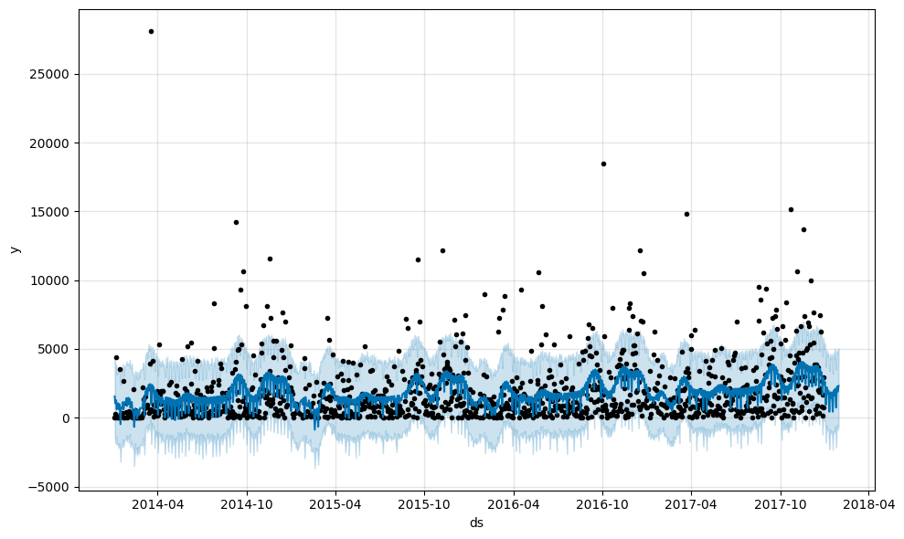
    


```python
# 7. Plot Trend Components

model.plot_components(forecast)
```


    

    


    
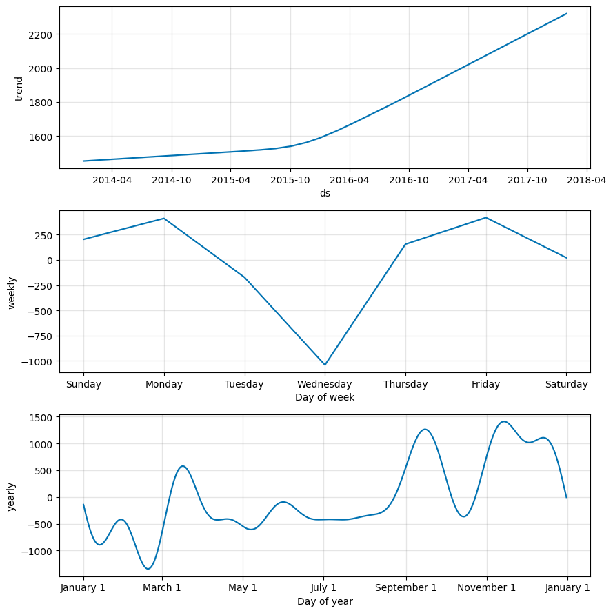
    


# 📊 Step 4: Exploratory Data Analysis (EDA)

### 4.1 Monthly Sales Trend
- Line plot of sales over months.
- Helps identify seasonal trends.

### 4.2 Sales by Category
- Bar plot comparing total sales across categories.

### 4.3 Profit by Region
- Bar plot showing which region is most profitable.

### 4.4 Top 10 Products by Sales
- Reveals best selling products in the store.


```python
import matplotlib.pyplot as plt
import seaborn as sns
df = pd.read_csv("/content/sample_data/SampleSuperstore.csv", encoding='latin1')
df.columns = df.columns.str.strip() # remove unwanted spaces
df['Order Date'] =pd.to_datetime(df['Order Date']) #convert Order Date to datetime to fetch month week day
```


```python
#from each row of Order Date we are fetching all this
df['Month'] = df['Order Date'].dt.month
df['Year'] = df['Order Date'].dt.year
df['Week'] = df['Order Date'].dt.isocalendar().week
df['Day'] = df['Order Date'].dt.day
df['DayOfWeek'] = df['Order Date'].dt.dayofweek
```


```python
df['IsWeekend'] = df['DayOfWeek'].apply(lambda x: 1 if x >= 5 else 0)
```


```python
# some manually holiday we given
import datetime
df['IsHoliday'] = df['Order Date'].isin([
    datetime.datetime(2019, 1, 1),
    datetime.datetime(2019, 8, 15),
    datetime.datetime(2019, 10, 2),
    datetime.datetime(2019, 12, 25)
]).astype(int)
```


```python
df['7D_MA'] = df['Sales'].rolling(window=7).mean()  # 7 fays mobving average
```


```python
# 4.1. Total Sales per Month
df['Month']=df['Order Date'].dt.to_period('M')
monthly_sales = df.groupby('Month')['Sales'].sum().reset_index()
monthly_sales['Month']=monthly_sales['Month'].astype(str)
plt.figure(figsize=(12,5)) # graph canvas size
sns.lineplot(data=monthly_sales, x='Month', y='Sales', marker='o') # marker='o' means graph will dot
plt.xticks(rotation=45)
plt.title('Monthly Sales Trend')
plt.show()
```


    
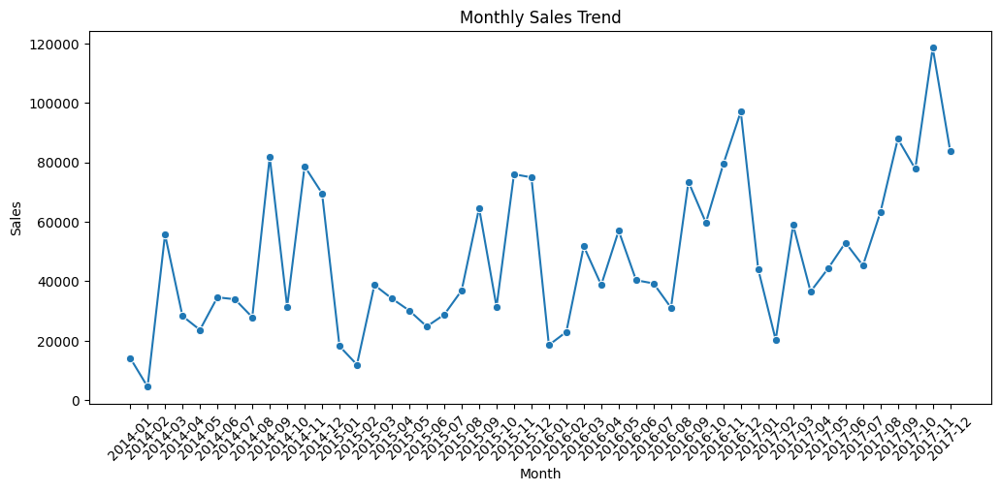
    


```python
# 4.2. Sales by Category
category_sales = df.groupby('Category')[['Sales','Profit']].sum().reset_index()
```


```python
# Category by sales
plt.figure(figsize=(7,5))
sns.barplot(data=category_sales, x='Category', y='Sales')
plt.title('Sales by Category')
plt.show()
```


    
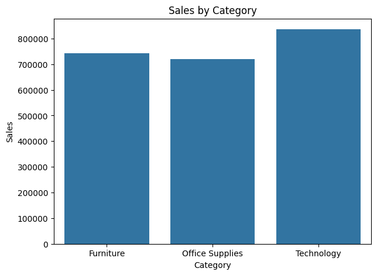
    


```python
# Category by Profit
plt.figure(figsize=(7,5))
sns.barplot(data=category_sales, x='Category', y='Profit')
plt.title('Profit by Category')
plt.show()
```


    
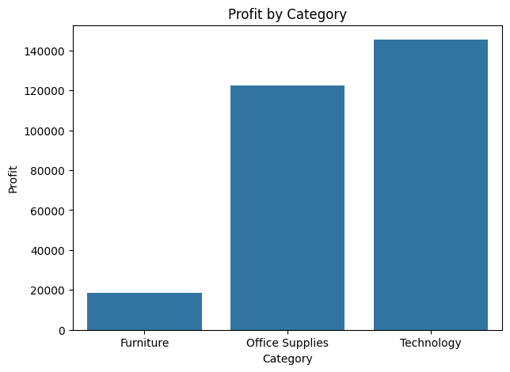
    


```python
# 4.3. Profit by Region

region_profit = df.groupby('Region')[['Sales','Profit']].sum().reset_index()
```


```python
#Region by Sales
plt.figure(figsize=(7,5))
sns.barplot(data=region_profit, x='Region', y='Sales')
plt.title('Sales by Regions')
plt.show()
```


    
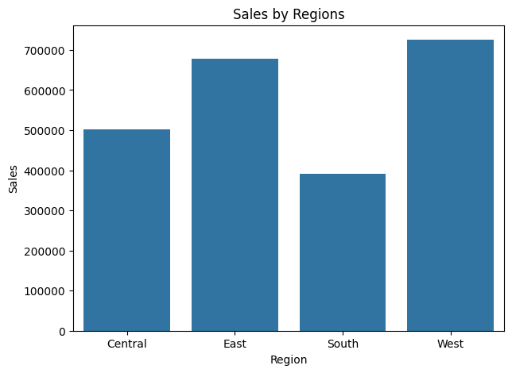
    


```python
#Region by Profit
plt.figure(figsize=(7,5))
sns.barplot(data=region_profit, x='Region', y='Profit')
plt.title('Profit by Regions')
plt.show()
```


    
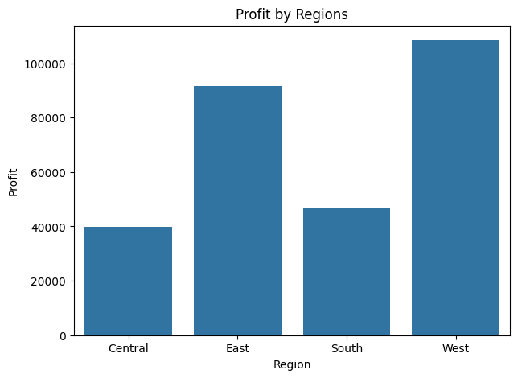
    


```python
# # 4.4. Top 10 Products by Sales
top_products = df.groupby('Product Name')[['Sales','Profit']].sum().nlargest(10, 'Sales').reset_index()
```


```python
# Product by sales
plt.figure(figsize=(10,6))
sns.barplot(data=top_products, x='Sales', y="Product Name")
plt.title('Top 10 Products by Sales')
plt.xlabel('Sales')
plt.ylabel('Product Name')
plt.show()

```


    
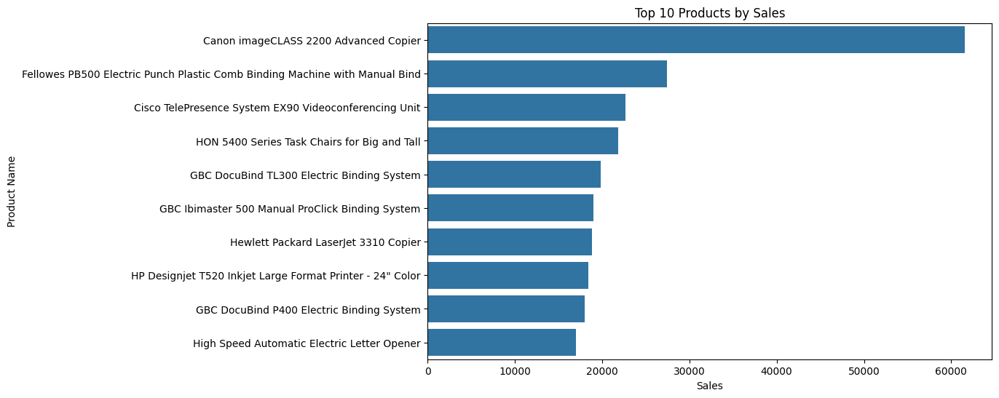
    


```python
#product by Profit
plt.figure(figsize=(10,6))
sns.barplot(data=top_products, x='Profit', y="Product Name")
plt.title('Top 10 Products by Profit')
plt.xlabel('Profit')
plt.ylabel('Product Name')
plt.show()
```


    
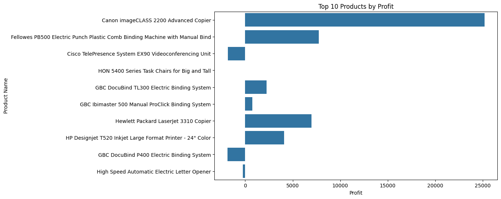
    


# 🧮 Step 5: Monthly Sales vs Profit Analysis

In this step, we analyze how **Sales and Profit vary month-wise** to identify business patterns across the year.

### ✅ Tasks Performed:
- Extracted the **month** from the `Order Date` column.
- Grouped data **month-wise** for both **Sales** and **Profit**.
- Used **bar plots** to compare monthly performance visually.


```python
# new column create : Month
df['Month'] = df['Order Date'].dt.to_period('M')

# 2. Group by Month and aggregate Sales and Profit
monthly_data = df.groupby('Month')[['Sales', 'Profit']].sum().reset_index()

# 3. Month column ko string banao for plotting
monthly_data['Month']=monthly_data['Month'].astype(str)

# 4. Plotting
plt.figure(figsize=(14,6))
sns.barplot(data=monthly_data, x='Month', y='Sales', color='skyblue', label='Sales')
sns.barplot(data=monthly_data, x='Month', y='Profit', color='green', label='Profit')
plt.xticks(rotation=45)
plt.title('Monthly Sales vs Profit')
plt.xlabel('Month')
plt.ylabel('Amount')
plt.legend()
plt.tight_layout()
plt.show()
```


    
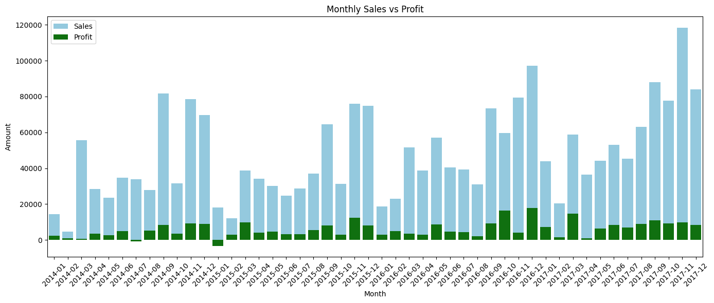
    


# 🧮 Step 6: Category-wise Sales and Profit Analysis

In this step, we analyze how much **Sales** and **Profit** are generated by different Product **Categories and Sub-Categories** to understand business performance better.


```python
#1. make Group Category-wise:

category_perf = df.groupby('Category')[['Sales','Profit']].sum().reset_index()
```


```python
# makr plot
plt.figure(figsize=(10,5))
sns.barplot(data=category_perf, x='Category', y='Sales')
plt.title('Category-wise Total Sales')
plt.ylabel('Sales in USD')
plt.show()
```


    
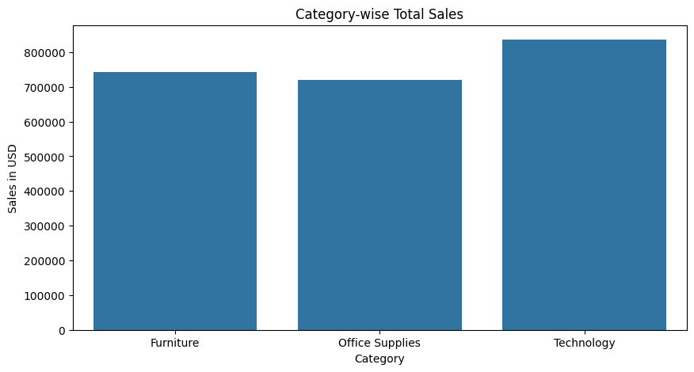
    


```python
#Profit  bar plot:
plt.figure(figsize=(10,5))
sns.barplot(data=category_perf, x='Category', y='Profit')
plt.title('Category-wise Total Profit')
plt.ylabel('Profit in USD')
plt.show()
```


    
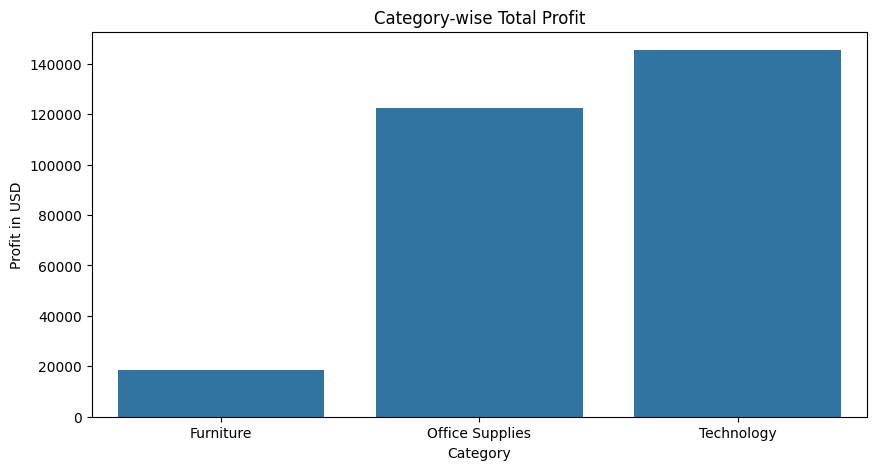
    


```python
subcat_perf = df.groupby('Sub-Category')[['Sales','Profit']].sum().reset_index()

plt.figure(figsize=(14,6))
sns.barplot(data=subcat_perf.sort_values(by='Sales', ascending=False), x='Sub-Category', y='Sales')
plt.title('Sub-Category-wise Total Sales')
plt.xticks(rotation=45) #tilted text in x axis
plt.show()

plt.figure(figsize=(14,6))
sns.barplot(data=subcat_perf.sort_values(by='Sales', ascending=False), x='Sub-Category', y='Profit')
plt.title('Sub-Category-wise Total Profit')
plt.xticks(rotation=45)
plt.show()
```


    
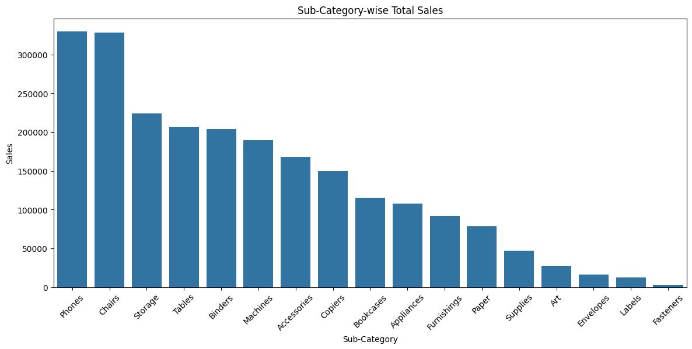
    


    
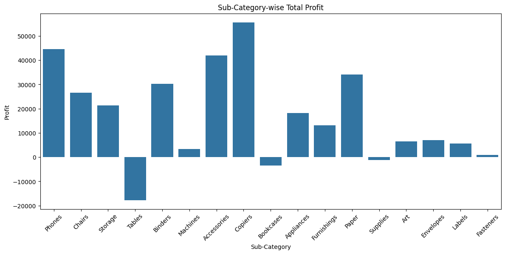
    


# 🧮 Step 7: State-wise Sales and Profit Analysis

Understand which states are performing well in terms of **sales and profit**, so business can target profitable regions and improve weak ones.

### ✅ Tasks Performed:
- Grouped data by State
- Bar plots of Sales and Profit
- Identify profitable and unprofitable states


```python
#1. Group by State

state_perf = df.groupby('State')[['Sales', 'Profit']].sum().reset_index()
```


```python
# 2. Sales Bar Plot - State Wise

plt.figure(figsize=(15,6))
sns.barplot(data=state_perf.sort_values(by='Sales', ascending=False), x='State', y='Sales')
plt.title("State-wise Total Sales")
plt.xticks(rotation=90)
plt.ylabel("Sales in USD")
plt.show()
```


    
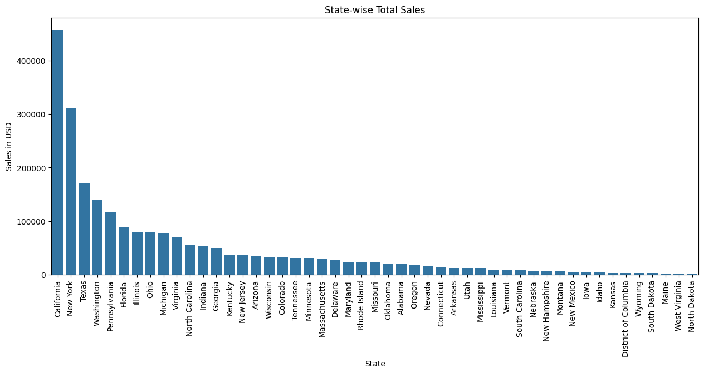
    


```python
# 3. Profit Bar Plot - State Wise

plt.figure(figsize=(15,6))
sns.barplot(data=state_perf.sort_values(by='Profit', ascending=False), x='State', y='Profit')
plt.title("State-wise Total Profit")
plt.xticks(rotation=90)
plt.ylabel("Profit in USD")
plt.show()
```


    
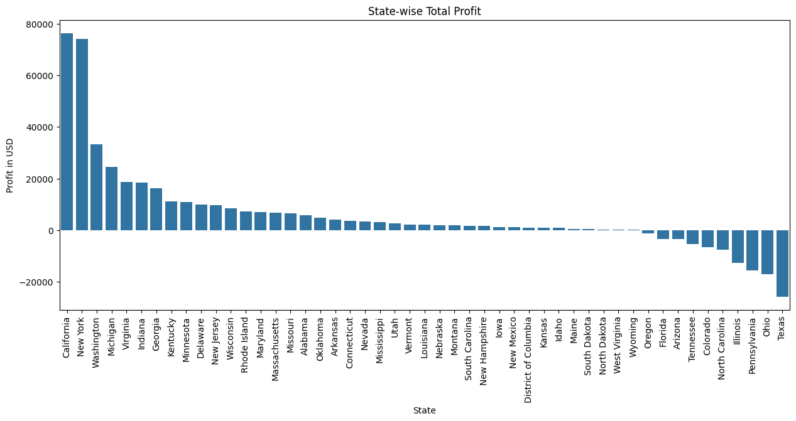
    


# 🧮 Step 8: Customer Segment-wise Performance Analysis
* Understand which customer segments are
* generating more revenue (Sales) and profit.Target karna aasaan ho business strategy ke liye.

### ✅ Tasks Performed:
- Segment-wise Sales & Profit
- 2 Bar Plots
- Targeted campaigns and offers per customer type


```python
#1. Segment-wise Grouping:
seg_perf = df.groupby('Segment')[['Sales', 'Profit']].sum().reset_index()
```


```python
#2. Segment-wise Sales Plot
plt.figure(figsize=(8,5))
sns.barplot(data=seg_perf.sort_values(by='Sales', ascending=False), x='Segment', y='Sales')
plt.title("Segment-wise Sales")
plt.ylabel("Sales in USD")
plt.show()

```


    
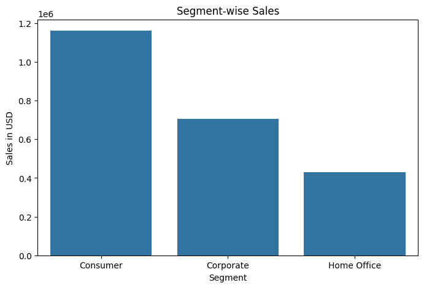
    


```python
#3. Segment-wise Profit Plot
plt.figure(figsize=(8,5))
sns.barplot(data=seg_perf.sort_values(by='Profit', ascending=False), x='Segment', y='Profit')
plt.title("Segment-wise Profit")
plt.ylabel("Profit in USD")
plt.show()

```


    
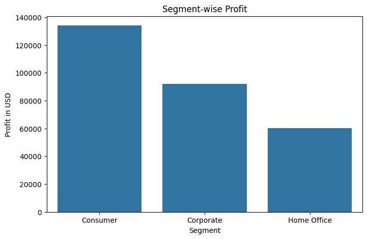
    


```python
df.to_csv("cleaned_superstore_data.csv", index=False)
```


```python
top_products = df.groupby('Product Name')['Sales'].sum().sort_values(ascending=False).head(10)
top_products.to_csv("top_10_products_by_sales.csv")
```


```python
category_profit = df.groupby('Category')['Profit'].sum()
category_profit.to_csv("category_profit_summary.csv")
```


```python
monthly_sales = df.groupby(['Region', 'Month'])['Sales'].sum().reset_index()
monthly_sales.to_csv("region_monthly_sales.csv", index=False)
```


```python
!pip install streamlit
```

    Collecting streamlit
      Downloading streamlit-1.47.1-py3-none-any.whl.metadata (9.0 kB)
    Requirement already satisfied: altair<6,>=4.0 in /usr/local/lib/python3.11/dist-packages (from streamlit) (5.5.0)
    Requirement already satisfied: blinker<2,>=1.5.0 in /usr/local/lib/python3.11/dist-packages (from streamlit) (1.9.0)
    Requirement already satisfied: cachetools<7,>=4.0 in /usr/local/lib/python3.11/dist-packages (from streamlit) (5.5.2)
    Requirement already satisfied: click<9,>=7.0 in /usr/local/lib/python3.11/dist-packages (from streamlit) (8.2.1)
    Requirement already satisfied: numpy<3,>=1.23 in /usr/local/lib/python3.11/dist-packages (from streamlit) (2.0.2)
    Requirement already satisfied: packaging<26,>=20 in /usr/local/lib/python3.11/dist-packages (from streamlit) (25.0)
    Requirement already satisfied: pandas<3,>=1.4.0 in /usr/local/lib/python3.11/dist-packages (from streamlit) (2.2.2)
    Requirement already satisfied: pillow<12,>=7.1.0 in /usr/local/lib/python3.11/dist-packages (from streamlit) (11.3.0)
    Requirement already satisfied: protobuf<7,>=3.20 in /usr/local/lib/python3.11/dist-packages (from streamlit) (5.29.5)
    Requirement already satisfied: pyarrow>=7.0 in /usr/local/lib/python3.11/dist-packages (from streamlit) (18.1.0)
    Requirement already satisfied: requests<3,>=2.27 in /usr/local/lib/python3.11/dist-packages (from streamlit) (2.32.3)
    Requirement already satisfied: tenacity<10,>=8.1.0 in /usr/local/lib/python3.11/dist-packages (from streamlit) (8.5.0)
    Requirement already satisfied: toml<2,>=0.10.1 in /usr/local/lib/python3.11/dist-packages (from streamlit) (0.10.2)
    Requirement already satisfied: typing-extensions<5,>=4.4.0 in /usr/local/lib/python3.11/dist-packages (from streamlit) (4.14.1)
    Collecting watchdog<7,>=2.1.5 (from streamlit)
      Downloading watchdog-6.0.0-py3-none-manylinux2014_x86_64.whl.metadata (44 kB)
         ━━━━━━━━━━━━━━━━━━━━━━━━━━━━━━━━━━━━━━━━ 44.3/44.3 kB 1.8 MB/s eta 0:00:00
    [?25hRequirement already satisfied: gitpython!=3.1.19,<4,>=3.0.7 in /usr/local/lib/python3.11/dist-packages (from streamlit) (3.1.44)
    Collecting pydeck<1,>=0.8.0b4 (from streamlit)
      Downloading pydeck-0.9.1-py2.py3-none-any.whl.metadata (4.1 kB)
    Requirement already satisfied: tornado!=6.5.0,<7,>=6.0.3 in /usr/local/lib/python3.11/dist-packages (from streamlit) (6.4.2)
    Requirement already satisfied: jinja2 in /usr/local/lib/python3.11/dist-packages (from altair<6,>=4.0->streamlit) (3.1.6)
    Requirement already satisfied: jsonschema>=3.0 in /usr/local/lib/python3.11/dist-packages (from altair<6,>=4.0->streamlit) (4.25.0)
    Requirement already satisfied: narwhals>=1.14.2 in /usr/local/lib/python3.11/dist-packages (from altair<6,>=4.0->streamlit) (1.48.0)
    Requirement already satisfied: gitdb<5,>=4.0.1 in /usr/local/lib/python3.11/dist-packages (from gitpython!=3.1.19,<4,>=3.0.7->streamlit) (4.0.12)
    Requirement already satisfied: python-dateutil>=2.8.2 in /usr/local/lib/python3.11/dist-packages (from pandas<3,>=1.4.0->streamlit) (2.9.0.post0)
    Requirement already satisfied: pytz>=2020.1 in /usr/local/lib/python3.11/dist-packages (from pandas<3,>=1.4.0->streamlit) (2025.2)
    Requirement already satisfied: tzdata>=2022.7 in /usr/local/lib/python3.11/dist-packages (from pandas<3,>=1.4.0->streamlit) (2025.2)
    Requirement already satisfied: charset-normalizer<4,>=2 in /usr/local/lib/python3.11/dist-packages (from requests<3,>=2.27->streamlit) (3.4.2)
    Requirement already satisfied: idna<4,>=2.5 in /usr/local/lib/python3.11/dist-packages (from requests<3,>=2.27->streamlit) (3.10)
    Requirement already satisfied: urllib3<3,>=1.21.1 in /usr/local/lib/python3.11/dist-packages (from requests<3,>=2.27->streamlit) (2.5.0)
    Requirement already satisfied: certifi>=2017.4.17 in /usr/local/lib/python3.11/dist-packages (from requests<3,>=2.27->streamlit) (2025.7.14)
    Requirement already satisfied: smmap<6,>=3.0.1 in /usr/local/lib/python3.11/dist-packages (from gitdb<5,>=4.0.1->gitpython!=3.1.19,<4,>=3.0.7->streamlit) (5.0.2)
    Requirement already satisfied: MarkupSafe>=2.0 in /usr/local/lib/python3.11/dist-packages (from jinja2->altair<6,>=4.0->streamlit) (3.0.2)
    Requirement already satisfied: attrs>=22.2.0 in /usr/local/lib/python3.11/dist-packages (from jsonschema>=3.0->altair<6,>=4.0->streamlit) (25.3.0)
    Requirement already satisfied: jsonschema-specifications>=2023.03.6 in /usr/local/lib/python3.11/dist-packages (from jsonschema>=3.0->altair<6,>=4.0->streamlit) (2025.4.1)
    Requirement already satisfied: referencing>=0.28.4 in /usr/local/lib/python3.11/dist-packages (from jsonschema>=3.0->altair<6,>=4.0->streamlit) (0.36.2)
    Requirement already satisfied: rpds-py>=0.7.1 in /usr/local/lib/python3.11/dist-packages (from jsonschema>=3.0->altair<6,>=4.0->streamlit) (0.26.0)
    Requirement already satisfied: six>=1.5 in /usr/local/lib/python3.11/dist-packages (from python-dateutil>=2.8.2->pandas<3,>=1.4.0->streamlit) (1.17.0)
    Downloading streamlit-1.47.1-py3-none-any.whl (9.9 MB)
       ━━━━━━━━━━━━━━━━━━━━━━━━━━━━━━━━━━━━━━━━ 9.9/9.9 MB 68.2 MB/s eta 0:00:00
    [?25hDownloading pydeck-0.9.1-py2.py3-none-any.whl (6.9 MB)
       ━━━━━━━━━━━━━━━━━━━━━━━━━━━━━━━━━━━━━━━━ 6.9/6.9 MB 95.5 MB/s eta 0:00:00
    [?25hDownloading watchdog-6.0.0-py3-none-manylinux2014_x86_64.whl (79 kB)
       ━━━━━━━━━━━━━━━━━━━━━━━━━━━━━━━━━━━━━━━━ 79.1/79.1 kB 6.3 MB/s eta 0:00:00
    [?25hInstalling collected packages: watchdog, pydeck, streamlit
    Successfully installed pydeck-0.9.1 streamlit-1.47.1 watchdog-6.0.0
    


```python
# Install ngrok
!pip install pyngrok

# Import it
from pyngrok import ngrok

# Connect your account (replace YOUR_AUTH_TOKEN with your real token)
!ngrok config add-authtoken <YOUR_AUTH_TOKEN>

```

    Collecting pyngrok
      Downloading pyngrok-7.2.12-py3-none-any.whl.metadata (9.4 kB)
    Requirement already satisfied: PyYAML>=5.1 in /usr/local/lib/python3.11/dist-packages (from pyngrok) (6.0.2)
    Downloading pyngrok-7.2.12-py3-none-any.whl (26 kB)
    Installing collected packages: pyngrok
    Successfully installed pyngrok-7.2.12
    Authtoken saved to configuration file: /root/.config/ngrok/ngrok.yml
    


```python
import pandas as pd
import numpy as np
from datetime import datetime, timedelta

# Create 100 rows of mock data
np.random.seed(42)
n = 100

data = {
    "Order ID": [f"ORD{i:04d}" for i in range(n)],
    "Order Date": pd.date_range(start="2024-01-01", periods=n, freq='D'),
    "Region": np.random.choice(["North", "South", "East", "West"], n),
    "Category": np.random.choice(["Electronics", "Clothing", "Home"], n),
    "Sales": np.random.randint(100, 2000, size=n),
    "Profit": np.random.randint(-200, 800, size=n),
    "Discount": np.random.uniform(0.0, 0.3, size=n),
    "IsWeekend": [date.weekday() >= 5 for date in pd.date_range("2024-01-01", periods=n)],
    "IsHoliday": np.random.choice([True, False], n, p=[0.1, 0.9])
}

df = pd.DataFrame(data)
df.to_csv("your_final_dataset.csv", index=False)


```


```python
df = pd.read_csv("/content/your_final_dataset.csv", parse_dates=["Order Date"])
```


```python
import os
os.system("nohup streamlit run /content/sample_data/app.py &")
```


    0


```python
!pkill -f ngrok
```


```python
public_url = ngrok.connect("http://localhost:8501")
print("🔗 Your Streamlit Dashboard URL:", public_url)
```

    🔗 Your Streamlit Dashboard URL: NgrokTunnel: "https://a8bf842d52fa.ngrok-free.app" -> "http://localhost:8501"
    
